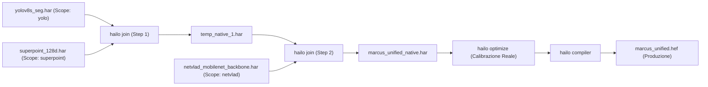

# 🧠 Guida Completa alla Compilazione dei Modelli HEF per Hailo-10H NPU

## 1. Introduzione e Architettura Hardware
La piattaforma AI di Marcus utilizza un **Raspberry Pi AI HAT+** equipaggiato con una **NPU Hailo-10H** da **40 TOPS**, collegata al Raspberry Pi 5 tramite bus **PCIe Gen 3** (`SPEC-03`).
L'acceleratore esegue inferenze neurali a bassissima latenza operando su formati binari proprietari denominati **HEF** (Hailo Executable Format), generati tramite il toolchain **Hailo Dataflow Compiler (DFC)**.

Questa guida descrive in modo rigoroso e riproducibile l'intera pipeline di esportazione, ottimizzazione, quantizzazione e unificazione multi-rete dei modelli neurali di bordo.

---

## 2. Prerequisiti & Ambiente di Compilazione (WSL 2)

Per eseguire la compilazione senza conflitti con i driver hardware e con il kernel ARM del Pi 5, la compilazione viene eseguita su workstation PC all'interno di **WSL 2** (distribuzione `Ubuntu-24.04` x86_64).

### 2.1 Struttura dell'Ambiente Virtuale
```bash
# Connessione all'ambiente WSL 2 dedicato
wsl -d Ubuntu-24.04

# Attivazione dell'ambiente virtuale DFC
source /home/robopy/hailo_env/bin/activate

# Verifica della versione installata (Richiesta DFC 5.3.0+)
hailo --version
# Output atteso: Hailo Dataflow Compiler v5.3.0
```

---

## 3. Pipeline di Compilazione YOLOv8s (Segmentazione / Detection)

### 3.1 Esportazione ONNX da PyTorch (Ultralytics)
Il modello di partenza è il checkpoint ufficiale `yolov8s-seg.pt` (o `yolov8s.pt` per sola detection).
L'esportazione deve rispettare dimensioni fisse (640x640), opset 12 e formato canali NCHW standard:

```bash
# Esecuzione da ambiente Python con ultralytics installato
yolo export model=yolov8s-seg.pt format=onnx imgsz=640 opset=12 dynamic=False
```
Questo genera `yolov8s-seg.onnx`.

### 3.2 Parsing e Generazione dell'Archivio HAR
Il comando `hailo parser onnx` converte il grafo computazionale ONNX nel formato intermedio di Hailo (**HAR** - Hailo Archive):

```bash
hailo parser onnx \
    --hw-arch hailo10h \
    --net-name yolov8s_seg \
    yolov8s-seg.onnx
```
Questo comando produce `yolov8s_seg.har`.

### 3.3 Creazione dello Script di Modello (`yolo_spec.alls`)
> [!CRITICAL]
> **OBBLIGO DELLA DIRETTIVA DI NORMALIZZAZIONE:**
> I modelli YOLO sono addestrati assumendo che i pixel dell'immagine siano float normalizzati nell'intervallo $[0.0, 1.0]$ (`pixel / 255.0`).
> A runtime, il driver C++ `hailo_bridge_node_cpp` alimenta la NPU con buffer di byte grezzi a 8-bit `uint8` nell'intervallo $[0, 255]$.
> Per evitare discrepanze di scala e clipping dinamico, la NPU DEVE integrare la normalizzazione hardware nel primo layer.

Creare il file `yolo_spec.alls`:
```text
# yolo_spec.alls - Direttive di compilazione Hailo per YOLOv8s
normalization1 = normalization([0.0, 0.0, 0.0], [255.0, 255.0, 255.0])
change_output_activation(conv45, sigmoid)
change_output_activation(conv61, sigmoid)
change_output_activation(conv74, sigmoid)
```

### 3.4 Preparazione del Dataset di Calibrazione Reale (Anti-Degrado INT8)
> [!CAUTION]
> **DIVIETO DI UTILIZZO DI `--use-random-calib-set` IN PRODUZIONE:**
> Calibrare la quantizzazione INT8 su rumore casuale uniforme distrugge la precisione delle teste di classificazione, saturando la rete di falsi positivi (es. divani scambiati per persone).
> La calibrazione richiede almeno **128-256 fotografie reali** tratte dal dataset COCO (`val2017`).

Script Python per generare l'array di calibrazione `calib_set_coco.npy`:
```python
import os
import cv2
import numpy as np

IMG_DIR = "coco_val2017_subset/"  # Cartella con 256 immagini JPEG reali
CALIB_FILE = "calib_set_coco.npy"

images = []
for fname in sorted(os.listdir(IMG_DIR))[:256]:
    if not fname.lower().endswith(('.jpg', '.jpeg', '.png')):
        continue
    img = cv2.imread(os.path.join(IMG_DIR, fname))
    if img is None:
        continue
    # Ridimensionamento Letterbox a 640x640 con padding grigio 114
    h, w = img.shape[:2]
    scale = min(640 / h, 640 / w)
    nh, nw = int(h * scale), int(w * scale)
    resized = cv2.resize(img, (nw, nh))
    letterbox = np.full((640, 640, 3), 114, dtype=np.uint8)
    top = (640 - nh) // 2
    left = (640 - nw) // 2
    letterbox[top:top+nh, left:left+nw] = resized
    
    # Conversione BGR -> RGB e salvataggio uint8 [0, 255]
    rgb = cv2.cvtColor(letterbox, cv2.COLOR_BGR2RGB)
    images.append(rgb)

calib_array = np.array(images, dtype=np.uint8)
np.save(CALIB_FILE, calib_array)
print(f"Salvati {len(images)} campioni in {CALIB_FILE} con shape {calib_array.shape}")
```

### 3.5 Ottimizzazione e Quantizzazione INT8
Eseguire l'ottimizzazione fornendo il dataset reale e lo script di modello:
```bash
export CUDA_VISIBLE_DEVICES=""
hailo optimize \
    --hw-arch hailo10h \
    --model-script yolo_spec.alls \
    --calib-set-path calib_set_coco.npy \
    yolov8s_seg.har
```
Questo comando produce `yolov8s_seg_optimized.har`.

---

## 4. Pipeline SuperPoint (Feature Extraction VIO)

1. **Esportazione ONNX:** Risoluzione fissa 320x200 (o 160x120) monochrome 1-canale.
2. **Parsing HAR:**
   ```bash
   hailo parser onnx --hw-arch hailo10h --net-name superpoint_128d superpoint_128d.onnx
   ```
3. **Ottimizzazione:**
   ```bash
   hailo optimize --hw-arch hailo10h superpoint_128d.har
   ```
   Produce `superpoint_128d_optimized.har`.

---

## 5. Pipeline NetVLAD Backbone (Visual Place Recognition)

A causa delle limitazioni di HailoRT sulle operazioni di pooling multidimensionale ed L2-norm su tensori 4D, il modello NetVLAD è suddiviso architetturalmente:
- **Su NPU:** Solo il Feature Extractor (Backbone MobileNetV2 + 1x1 conv reducer), che produce una feature map compattata `[1, 128, 7, 10]`.
- **Su CPU Host (C++ / NumPy):** Soft-assignment, accumulo residui e pooling globale (<1ms di latenza CPU).

```bash
# Parsing ONNX Backbone
hailo parser onnx --hw-arch hailo10h --net-name netvlad netvlad_mobilenet_backbone.onnx
# Ottimizzazione
hailo optimize --hw-arch hailo10h netvlad.har
```
Produce `netvlad_mobilenet_backbone_optimized.har`.

---

## 6. Unificazione dei Contesti: Generazione di `marcus_unified.hef`

Per azzerare l'overhead di context-switching sul firmware PCIe della NPU, i tre modelli vengono fusi in un singolo archivio unificato prima della compilazione finale:



### Comandi Sequenziali di Join & Compile:
```bash
# Step 1: Unione YOLO + SuperPoint
hailo join --join-action none \
    --scope-name1 yolo \
    --scope-name2 superpoint \
    yolov8s_seg.har superpoint_128d.har \
    --output-path temp_joint_1.har

# Step 2: Unione con NetVLAD
hailo join --join-action none \
    --scope-name2 netvlad \
    temp_joint_1.har netvlad_mobilenet_backbone.har \
    --output-path marcus_unified_native.har

# Step 3: Ottimizzazione Unificata con Calibrazione Reale
hailo optimize \
    --hw-arch hailo10h \
    --model-script marcus_unified.alls \
    --calib-set-path calib_set_coco.npy \
    marcus_unified_native.har

# Step 4: Compilazione Finale HEF
hailo compiler \
    --hw-arch hailo10h \
    marcus_unified_optimized.har
```
Il file risultante viene denominato **`marcus_unified.hef`** (dimensione tipica ~14-16 MB) e distribuito sul robot in `/mnt/ssd/models/marcus_unified.hef`.

---

## 7. Ispezione e Validazione a Runtime con `hailortcli`

Sul Raspberry Pi 5 con HailoRT installato, verificare l'integrità dei flussi del file HEF prima del deploy nei nodi ROS 2:

```bash
# Ispezione dei layer di input e output
hailortcli parse-hef /mnt/ssd/models/marcus_unified.hef

# Benchmark di throughput e stabilità termica
hailortcli benchmark /mnt/ssd/models/marcus_unified.hef
```

---

## 8. Check-list di Risoluzione Problemi Comuni (Troubleshooting)

| Sintomo / Errore | Causa Radice | Soluzione Risolutiva |
| :--- | :--- | :--- |
| **`CHECK failed - Couldnt find input buffer for 'netvlad/input_layer1'`** | Tentativo di eseguire un HEF multi-stream senza pre-allocare e collegare tutti i buffer di input. | In `src/hailo_bridge_node.cpp`, iterare su tutti gli stream definiti in `infer_model->inputs()` ed eseguire `in_stream->set_buffer()` per ciascuno prima di invocare `run()` (`SPEC-03`). |
| **`HAILO_NOT_IMPLEMENTED`** | Utilizzo delle API legacy `VStream` o `ConfigureParams.create_from_hef`. | Utilizzare esclusivamente l'API moderna `InferModel` via `VDevice.create_infer_model()` (`SPEC-03`, `FM-VIS-005`). |
| **Falsi positivi "persona" su divani / arredi** | Input telecamera monocromatico, aspect ratio stirato senza letterbox, quantizzazione sintetica `--use-random-calib-set`. | Abilitare stream RGB nativo su OAK-D Lite, applicare letterbox 1:1 in C++, alzare `conf_thresh >= 0.55` e ricompilare con dataset COCO reale (`FM-VIS-009`). |
| **Punteggi di confidenza > 3,000,000%** | Mancata dequantizzazione hardware degli output float32. | Invocare `outp.set_format_type(HAILO_FORMAT_TYPE_FLOAT32)` prima di `infer_model->configure()` (`SPEC-03`). |
| **`X_LINK_ERROR` all'avvio simultaneo** | Camera OAK-D Lite collegata su bus USB 2.0 o calo di tensione all'avvio. | Connessione su porta USB 3.0 (blu) tramite hub alimentato esternamente (`SPEC-03`, `FM-VIS-001/004`). |
