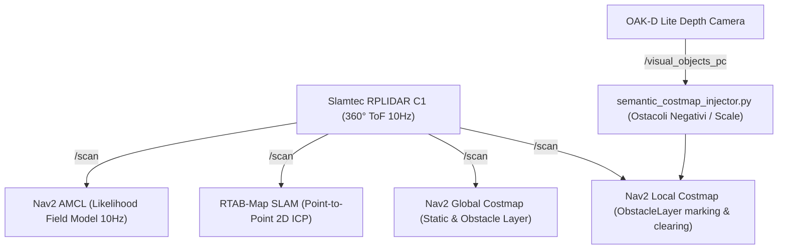

# 🚀 Progetto di Miglioramento IMP-NAV-018: Copertura Sensoriale 360° con LiDAR Slamtec RPLIDAR C1 ToF

---

## 📌 Scheda di Identificazione e Riferimenti
* **ID Progetto:** `IMP-NAV-018`
* **Failure Mode Correlato (DFMEA):** `FM-NAV-018` (Cecità geometrica totale al di fuori del campo visivo primario FOV 72.9° H)
* **Dominio Architetturale:** `nav2_slam`
* **Stato Progetto:** `COMPLETED`
* **Data Completamento:** 2026-09-25
* **Scheda Tecnica di Riferimento:** [`docs/specs/SPEC-02_navigation_and_slam.md`](file:///c:/Users/lsuffia/OneDrive%20-%20BRUGOLA%20OEB%20INDUSTRIALE%20SPA/Documents/robopy/antigravity/docs/specs/SPEC-02_navigation_and_slam.md)
* **ECO Correlati:**
  - [`docs/ecos/nav2_slam_ecos.md#ECO-2026-09-04-001`](file:///c:/Users/lsuffia/OneDrive%20-%20BRUGOLA%20OEB%20INDUSTRIALE%20SPA/Documents/robopy/antigravity/docs/ecos/nav2_slam_ecos.md#ECO-2026-09-04-001) (Integrazione hardware RPLIDAR C1 360° ToF e Udev Serial Binding)
  - [`docs/ecos/nav2_slam_ecos.md#ECO-2026-09-06-001`](file:///c:/Users/lsuffia/OneDrive%20-%20BRUGOLA%20OEB%20INDUSTRIALE%20SPA/Documents/robopy/antigravity/docs/ecos/nav2_slam_ecos.md#ECO-2026-09-06-001) (Calibrazione Orientamento Yaw 180° RPLIDAR C1)
  - [`docs/ecos/nav2_slam_ecos.md#ECO-2026-09-06-002`](file:///c:/Users/lsuffia/OneDrive%20-%20BRUGOLA%20OEB%20INDUSTRIALE%20SPA/Documents/robopy/antigravity/docs/ecos/nav2_slam_ecos.md#ECO-2026-09-06-002) (RTAB-Map 360° LiDAR ICP Loop Closure)
  - [`docs/ecos/nav2_slam_ecos.md#ECO-2026-09-15-002`](file:///c:/Users/lsuffia/OneDrive%20-%20BRUGOLA%20OEB%20INDUSTRIALE%20SPA/Documents/robopy/antigravity/docs/ecos/nav2_slam_ecos.md#ECO-2026-09-15-002) (AMCL 2D Localization ad Alta Frequenza su `/scan`)

---

## 🎯 1. Problema Ingegneristico & Failure Mode Iniziale

### 1.1 Descrizione del Limite Hardware
Marcus faceva originariamente affidamento esclusivo sulla videocamera stereo OAK-D Lite per la percezione spaziale. La videocamera presenta un campo visivo orizzontale limitato a $72.9^\circ$:
- **Angolo cieco perimetrale di $287.1^\circ$:** Durante rotazioni sul posto, curve strette o manovre di retromarcia/recovery, il robot non disponeva di alcuna informazione geometrica su ostacoli situati sui fianchi o alle spalle.
- **Rischio di collisione elevato:** Urto contro zoccoli di mobili, sedie, pareti o persone/animali durante le manovre di navigazione autonoma Nav2.
- **Valutazione del Rischio Iniziale:**
  $$RPN_{init} = S(9) \times O(9) \times D(9) = 729 \quad (\text{REVISION\_MANDATORY})$$

---

## 🛠️ 2. Soluzione Ingegneristica Adottata

La soluzione ha previsto l'integrazione a bordo di un sensore LiDAR 2D a scansione continua a 360° basato su tecnologia Time-of-Flight (ToF).



### 2.1 Specifiche Hardware & Driver
* **Sensore:** Slamtec RPLIDAR C1 (Laser ToF compatto, portata fino a 16m metrici, accuratezza centimetrica, immunità alla luce ambiente fino a 40.000 lux).
* **Frequenza di campionamento:** 10 Hz nominale.
* **Interfaccia Host:** Porta seriale CP2102N UART over USB a **460.800 baud**.
* **Driver ROS 2:** `sllidar_ros2` (`sllidar_node`) compilato per ROS 2 Jazzy.

### 2.2 Persistenza Seriale Udev
Per evitare inversioni dinamiche con la scheda motori Waveshare ESP32 al boot, è stata introdotta la regola in `/etc/udev/rules.d/99-marcus-serial.rules`:
```udev
SUBSYSTEM=="tty", ATTRS{idVendor}=="10c4", ATTRS{idProduct}=="ea60", ATTRS{serial}=="1af3e590ed31f11197da945f30d20014", SYMLINK+="rplidar", MODE="0666"
```

### 2.3 Calibrazione Trasformata TF2
Il sensore è montato in posizione sopraelevata sul top chassis:
* **Frame ID:** `laser` (parent: `base_link`)
* **Offset di montaggio CAD:** $X = +0.08\,\text{m}$, $Y = 0.00\,\text{m}$, $Z = +0.18\,\text{m}$
* **Orientamento Azimuth Zero:** Poiché l'azimuth zero hardware del LiDAR è rivolto all'indietro rispetto al muso del robot, la trasformata statica corregge la rotazione:
  $$\text{yaw} = \pi\,\text{rad} = 3.14159265\,\text{rad} \quad (180^\circ \text{ attorno all'asse } Z)$$

### 2.4 Integrazione Multilivello nello Stack ROS 2

1. **Nav2 Local & Global Costmaps (`nav2_params_jazzy.yaml`):**
   * Configurato `ObstacleLayer` con sorgente primaria `/scan` (`data_type: "LaserScan"`).
   * Raggio massimo di ostacolo locale: $4.5\,\text{m}$, raggio massimo globale: $8.0\,\text{m}$.
   * `clearing: true` e `marking: true` continui per pulizia rapida dello spazio libero e tracciamento immediato di ostacoli dinamici a 360°.
2. **RTAB-Map SLAM ICP 2D (`rtabmap.yaml`):**
   * Registrazione geometrica pura `Reg/Strategy: "1"` (Point-to-Point ICP LiDAR) a 360°.
   * Ricerca proximity loop a 360° (`RGBD/ProximityAngle: "360"`), consentendo chiusure d'anello anche senza orientamento visivo frontale o in assenza totale di luce.
3. **Nav2 AMCL 2D Localization (`custom_nav2_launch.py`):**
   * Modello a campo di verosimiglianza (`likelihood_field`) alimentato dal flusso a 10 Hz del LiDAR per localizzazione robusta con zero drift angolare su mappe note.
4. **Coesistenza Multi-Sensore con OAK-D Lite:**
   * La camera OAK-D Lite mantiene la responsabilità della sicurezza volumetrica: rilevamento ostacoli negativi ($\Delta Z > 15\,\text{cm}$) e caduta scale tramite `semantic_costmap_injector.py` proiettati su `/visual_objects_pc`.
5. **Smart Standby Energetico (`FM-PWR-001`):**
   * `sensor_standby_manager.py` spegne automaticamente il motore del LiDAR (`/stop_motor`) e congela RTAB-Map dopo 120s di inattività per prolungare la vita del cuscinetto e risparmiare fino a 2W di alimentazione.

---

## 📊 3. Risultati e Ricalcolo del Rischio (DFMEA)

| Parametro DFMEA | Prima della Mitigazione | Post-Integrazione RPLIDAR C1 |
| :--- | :---: | :---: |
| **Severità (S)** | 9 | **9** *(Impatto potenziale di collisione fisica preservato)* |
| **Occorrenza (O)** | 9 | **1** *(Presenza continua di scansione a 360° ad alta frequenza)* |
| **Rilevabilità (D)** | 9 | **1** *(Rilevamento istantaneo < 100ms e marcatura in costmap)* |
| **RPN Residuo** | **729** | **9** *(Rischio sotto controllo)* |
| **Stato Mitigazione** | `OPEN` | **`CLOSED`** |

---

## 🔍 4. Piano di Verifica e Non-Regressione
* **Test Unitario Automatizzato:** `test/unit/test_fm_nav_018_lidar_coverage.py`
  - Validazione presenza e configurazione `/scan` in Nav2 local e global costmaps.
  - Verifica binding `/dev/rplidar` e trasformata statica TF2 `--yaw 3.14159265`.
  - Verifica stato `CLOSED` e $RPN \le 9$ in `fmea/dfmea.yaml`.
* **Verifica Visiva:** Ispezione su Foxglove Studio dello stream `/scan` a 360° e della proiezione corretta dei muri e ostacoli senza salti o distorsioni spaziali.
