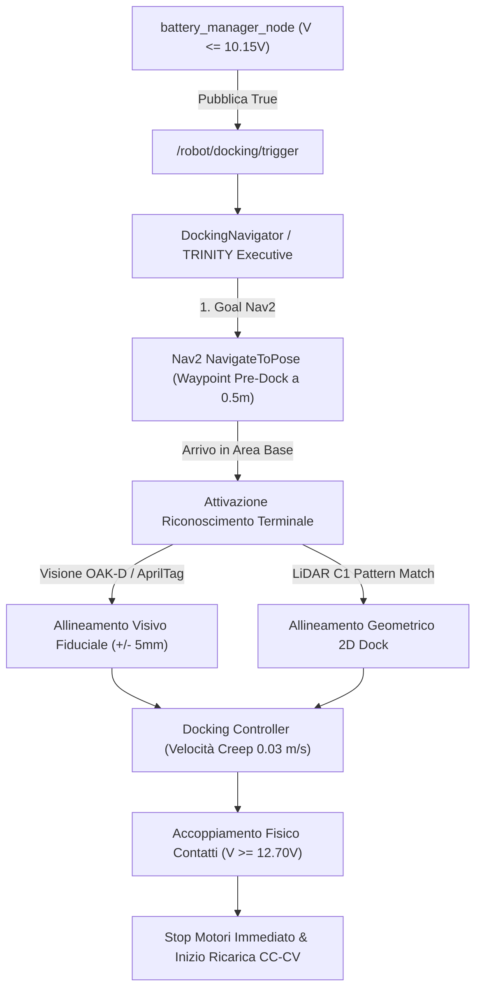

# IMP-PWR-004: Progettazione Cuccia di Ricarica e Sistema di Rientro Autonomo (Homing & Docking)

## 1. Riferimento Failure Mode DFMEA
- **ID Failure:** `FM-PWR-004`
- **Sottosistema:** Hardware / Power & Autonomous Docking (`battery_docking_system`)
- **Descrizione Guasto:** Esaurimento completo della batteria con robot abbandonato in punti remoti (Stranding) e scarica profonda distruttiva delle celle Li-ion 18650 per totale assenza di stazione di ricarica ("cuccia") e procedura di docking.
- **Causa Radice:** Assenza fisica della docking station a pavimento, assenza di contatti di ricarica dedicati sul telaio del robot e mancata implementazione della routine di homing e docking terminale in Nav2/TRINITY quando la tensione scende sotto la soglia di allarme (10.15V - 10.20V).
- **Initial Scoring:** Severity: 9, Occurrence: 8, Detection: 4 -> **RPN Iniziale: 288**
- **Livello di Rischio:** `REVISION_MANDATORY`
- **Stato:** `OPEN` (Progetto Pianificato)

---

## 2. Architettura della Soluzione e Requisiti Ingegneristici

### 1. Requisiti Meccanici & Elettrici della "Cuccia" (Docking Station)
1. **Struttura di Invito Meccanico:** Base a pavimento con guide coniche ad imbuto a basso attrito per autocentrare il robot durante l'avvicinamento frontale/posteriore (tolleranza di ingresso $\pm 25\text{ mm}$).
2. **Contatti di Ricarica Elettrica:** Coppia di contatti a lamina elastica in bronzo fosforoso / rame berillio sulla base e piastre metalliche sul telaio di Marcus. Contatti protetti da diodo di blocco Schottky per impedire cortocircuiti accidentali in caso di tocco con oggetti metallici estranei.
3. **Alimentazione di Ricarica:** Step-down regolabile CC-CV alimentato a 24V con uscita tarata esattamente a **$12.80\text{ V}$** e limite di corrente a **$1.50\text{ A}$** (compatibile con la chimica 3S2P Panasonic NCR18650B, 6800 mAh totali).
4. **Riconoscimento Immediato del Docking:** All'accoppiamento dei contatti, il bus DC_IN della scheda Waveshare rileva istantaneamente $V \ge 12.70\text{V}$, commutando lo stato in `POWER_SUPPLY_STATUS_CHARGING` e inibendo ogni ulteriore moto o rotazione (FM-NAV-035).

### 2. Architettura Software del Sistema di Rientro Autonomo (Homing & Docking)

1. **Trigger Predittivo:** Quando `battery_manager_node` conferma la soglia docking per oltre 3 secondi continuativi, emette un trigger su `/robot/docking/trigger`.
2. **Fase 1 - Navigazione Globale (Macro-Homing):** Il robot abbandona il task corrente (salvando lo stato) e pianifica un percorso Nav2 verso la posa pre-dock memorizzata sulla mappa (`/mnt/ssd/maps/salotto.yaml`).
3. **Fase 2 - Allineamento Fine (Micro-Docking Terminale):** 
   - Riconoscimento di un tag fiduciale (AprilTag / ArUco) montato sulla parete della cuccia tramite telecamera OAK-D Lite, oppure fitting geometrico della sagoma concava della cuccia da scansione LiDAR C1 ToF.
   - Controllo a circuito chiuso con velocità di avanzamento lentissima ($v = 0.03\text{ m/s}$) e correzione orientamento ($|w| \le 0.05\text{ rad/s}$) fino all'ingaggio dei contatti.
4. **Fase 3 - Conferma Elettrica e Scucciamento:** 
   - L'INA219 rileva $V \ge 12.70\text{V}$: il controllore arresta i motori, dichiara lo stato `DOCKED_DREAM` in `system_lifecycle_coordinator_node`, e rimane in carica fino al raggiungimento del 100% SoC ($V_{bus} = 12.80\text{V}$, corrente residua $< 150\text{ mA}$).
   - Raggiunto il 100%, emette il trigger `/robot/docking/undock_trigger` per la manovra autonoma di scucciamento.

---

## 3. Piano Operativo di Realizzazione
- **Fase A (Hardware Base):** Progettazione CAD 3D e stampa delle guide di imbocco, piastra contatti e cablaggio caricatore CC-CV 12.8V.
- **Fase B (Software Vision/LiDAR Docking):** Implementazione nodo `docking_detector_node` con OAK-D / AprilTag e pattern matching LiDAR.
- **Fase C (Nav2 Integration):** Creazione del custom Behavior Tree action plugin o Nav2 Docking Server.
- **Fase D (Validazione Integrata):** 50 cicli continui di homing, aggancio e ricarica senza intervento operatore.
