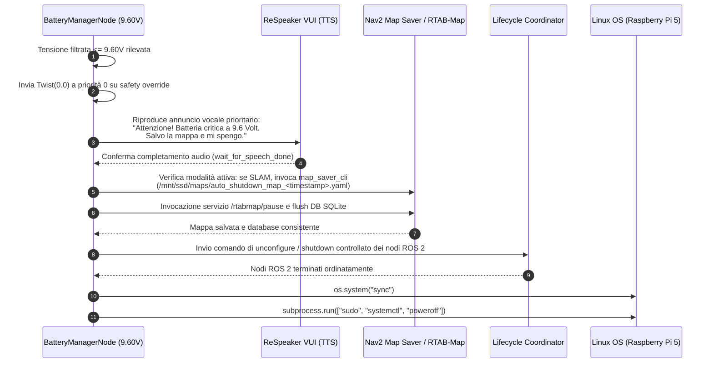

# IMP-PWR-005: Graceful Shutdown Orchestrator con Salvataggio Mappe e Allerta Vocale

## 1. Riferimento Failure Mode DFMEA
- **ID Failure:** `FM-PWR-005`
- **Sottosistema:** System / Software & Power (`lifecycle_shutdown_orchestrator / battery_manager`)
- **Descrizione Guasto:** Spegnimento brutale a freddo per sottotensione critica (9.60V) o crash Linux da poweroff disordinato, con perdita mappe SLAM in creazione, corruzione database SQLite (rtabmap/MAG) e assenza di segnalazione vocale all'utente.
- **Causa Radice:** Parametro `auto_poweroff` disabilitato di default in `battery_manager_node`; assenza di un orchestratore dedicato che coordini in sequenza deterministica: arresto moto -> annuncio vocale prioritario -> salvataggio mappa 2D Nav2 / flush RTAB-Map -> arresto pulito nodi ROS 2 -> sincronizzazione filesystem SSD -> `sudo poweroff`.
- **Initial Scoring:** Severity: 8, Occurrence: 8, Detection: 3 -> **RPN Iniziale: 192**
- **Livello di Rischio:** `HIGH`
- **Stato:** `OPEN` (Progetto Pianificato)

---

## 2. Analisi Ingegneristica delle Soglie e Limiti Fisici

### 1. Curva di Scarica Celle 18650 sotto Carico
- **100% Piena Carica (in esercizio sotto carico):** $12.10\text{ V} - 12.20\text{ V}$.
  - Sebbene la tensione a circuito aperto (OCV) sia di $12.60\text{ V}$ (4.20V/cella), non appena i carichi del Pi 5, NPU Hailo, LiDAR e camera OAK-D assorbono la corrente base di riposo ($\approx 1.2\text{ A}$), la caduta interna ohmica ($V_{drop} = I \cdot R_{int}$) abbassa la tensione misurata sul bus a $12.10\text{ V} - 12.20\text{ V}$.
- **Modalità ECO (Limitazione Dinamica 50%):** $10.20\text{ V}$ ($\approx 3.40\text{ V/cella}$).
  - Riduce la velocità massima e l'accelerazione dei motori per dimezzare i transitori di corrente e prevenire picchi di sag.
- **Soglia di Shutdown di Sicurezza:** $9.60\text{ V}$ ($\approx 3.20\text{ V/cella}$).
  - **VINCOLO CRITICO HARDWARE:** Il circuito BMS di protezione hardware del pacco batterie esegue il distacco secco (cutoff) a $\approx 9.70\text{ V} - 9.75\text{ V}$ se non filtrato o sotto picco di corrente.
  - Per poter eseguire uno spegnimento pulito a $9.60\text{ V}$, la procedura DEVE scattare tempestivamente senza ritardi di persistenza e i motori DEVONO essere immediatamente disattivati ($I_{motori} = 0\text{ A}$) per azzerare il sag e riportare la tensione del pacco sopra il cutoff BMS per i 10-15 secondi necessari alle operazioni di salvataggio e annuncio.

---

## 3. Architettura della Procedura di Spegnimento Coordinato

### Dettaglio Operativo dei Passi di Spegnimento:
1. **Freno Motori Immediato (0 ms):** Invio di `Twist(0, 0)` su `/cmd_vel_mux/input/safety_override` e disattivazione PWM motori in `waveshare_motor_driver`. Azzerando la corrente dei motori, la tensione risale di $150-300\text{ mV}$ evitando il distacco hardware immediato del BMS.
2. **Allerta Vocale Prioritaria (1-3 s):** Invio di chunk PCM a 24kHz su `/respeaker/speaker_audio` o sintesi via gTTS cache per pronunciare: *"Attenzione, batteria critica a 9.6 Volt. Procedura di spegnimento di emergenza in corso."*
3. **Persistenza Mappa SLAM (2-4 s):** Se il robot è stato avviato con flag `--slam`:
   - Esecuzione in background di `ros2 run nav2_map_server map_saver_cli -f /mnt/ssd/maps/emergency_map_$(date +%Y%m%d_%H%M%S)`.
   - Chiamata al servizio ROS 2 `/rtabmap/pause` o chiusura pulita per garantire che SQLite esegua il checkpoint del file `-wal` nel database primario `/mnt/ssd/rtabmap.db`.
4. **Terminazione Controllata ROS 2 (2 s):** Invio di segnale di terminazione controllato a tutti i nodi di calcolo (Hailo, VIO, Nav2, TRINITY) per rilasciare le porte seriali, fotocamere OAK-D e file descriptor.
5. **Flush Filesystem e Spegnimento OS (1 s):** Esecuzione di `sync` e comando `sudo systemctl poweroff -i`.
