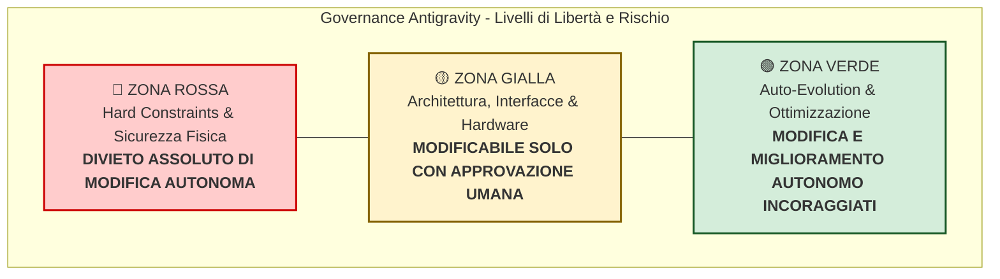

# 📐 Indice Generale Schede Tecniche & Governance Antigravity

Questo documento costituisce il registro centrale e il framework di **Governance e Ingegneria di Sistema** per lo sviluppo, la manutenzione e l'evoluzione autonoma del robot **Marcus**.
Quando l'agente AI **Antigravity** (basato su **Gemini 3.8**) opera direttamente sul Raspberry Pi 5 o nel workspace di sviluppo, **DEVI** consultare e rispettare rigorosamente le prescrizioni qui definite prima di qualsiasi proposta o modifica al codice.

---

## 🚦 Tassonomia delle Tre Zone di Sviluppo

Per garantire che l'evoluzione autonoma del robot non introduca **regressioni funzionali**, **danni hardware** (surriscaldamento, stallo motori, scarica profonda LiPo, corruzione SSD) o **collassi del sistema** (OOM Kill su 4GB di RAM, stalli realtime), ogni elemento software e hardware è classificato in una delle tre zone:

### 🔴 Zona Rossa (Hard Constraints - Inviolabili)
- **Definizione:** Vincoli fisici, limiti elettrici e termici, protocolli di sopravvivenza, pinout hardware, regole di compilazione sequenziale e costrutti anti-collisione/anti-caduta.
- **Politica Antigravity:** **DIVIETO ASSOLUTO DI MODIFICA AUTOMATICA.** L'agente AI non ha il permesso di modificare, disabilitare, bypassare o rilassare queste regole e parametri. Qualsiasi violazione blocca la pipeline di validazione.

### 🟡 Zona Gialla (Human Gate - Interlock Umano)
- **Definizione:** Modifiche strutturali che impattano l'interoperabilità di sistema: contratti di interfaccia ROS 2 (topics, services, actions, messaggi custom `.msg`/`.srv`), configurazioni del kernel/OS, modelli di rete neurale compilati HEF sulla NPU Hailo, variazione dei sensori o porte hardware (`/dev/ttyUSB0`, `/dev/ttyACM0`), rimappatura delle state machine critiche.
- **Politica Antigravity:** **MODIFICABILE SOLO PREVIA APPROVAZIONE UMANA ESPLICITA.** L'agente AI può analizzare il codice, formulare una proposta architetturale motivata e predisporre una Pull Request / diff, ma non può applicarla a caldo né promuoverla nel branch di produzione senza conferma umana.

### 🟢 Zona Verde (Auto-Evolution - Evoluzione Autonoma)
- **Definizione:** Logica applicativa interna, tuning fine di iperparametri entro range prestabiliti e validati, euristiche di decisione, arricchimento dei prompt LLM e meta-prompt fusion, algoritmi di filtraggio e stima, ottimizzazione delle performance computazionali e della memoria RAM, aggiunta di test unitari, refactoring interno a parità di interfaccia, arricchimento documentale.
- **Politica Antigravity:** **MODIFICA AUTONOMA CONSENTITA E INCORAGGIATA.** L'agente AI può iterare, ottimizzare e promuovere le modifiche in autonomia, purché la suite di test di non-regressione (`pytest`, test cinetici, linting) venga superata con esito 100% positivo.

---

## 📚 Elenco delle Schede Tecniche di Sottosistema

| Scheda | File di Riferimento | Macro-Dominio / Sottosistema | DFMEA Correlati |
| :---: | :--- | :--- | :--- |
| **SPEC-00** | [SPEC-00_antigravity_governance.md](file:///c:/Users/lsuffia/OneDrive%20-%20BRUGOLA%20OEB%20INDUSTRIALE%20SPA/Documents/robopy/antigravity/docs/specs/SPEC-00_antigravity_governance.md) | **Meta-Regole di Auto-Evoluzione Antigravity** | Tutti i domini (Governance, Sandboxing, CI locale) |
| **SPEC-01** | [SPEC-01_actuation_and_motion.md](file:///c:/Users/lsuffia/OneDrive%20-%20BRUGOLA%20OEB%20INDUSTRIALE%20SPA/Documents/robopy/antigravity/docs/specs/SPEC-01_actuation_and_motion.md) | **Chassis, Attuazione, Motori & Cinematica** | FM-MOT-001..006, FM-NAV-015 |
| **SPEC-02** | [SPEC-02_navigation_and_slam.md](file:///c:/Users/lsuffia/OneDrive%20-%20BRUGOLA%20OEB%20INDUSTRIALE%20SPA/Documents/robopy/antigravity/docs/specs/SPEC-02_navigation_and_slam.md) | **Navigazione, SLAM, Costmap 2.5D & Evitamento Ostacoli** | FM-NAV-001..019, FM-VIS-003 |
| **SPEC-03** | [SPEC-03_vision_and_hailo_npu.md](file:///c:/Users/lsuffia/OneDrive%20-%20BRUGOLA%20OEB%20INDUSTRIALE%20SPA/Documents/robopy/antigravity/docs/specs/SPEC-03_vision_and_hailo_npu.md) | **Visione Computazionale, OAK-D Lite & NPU Hailo-10H** | FM-VIS-001..008, FM-LLM-005 |
| **SPEC-04** | [SPEC-04_audio_vui_pipeline.md](file:///c:/Users/lsuffia/OneDrive%20-%20BRUGOLA%20OEB%20INDUSTRIALE%20SPA/Documents/robopy/antigravity/docs/specs/SPEC-04_audio_vui_pipeline.md) | **Voice User Interface (VUI) & Audio Pipeline** | FM-VUI-001..023 |
| **SPEC-05** | [SPEC-05_cognitive_brain_trinity.md](file:///c:/Users/lsuffia/OneDrive%20-%20BRUGOLA%20OEB%20INDUSTRIALE%20SPA/Documents/robopy/antigravity/docs/specs/SPEC-05_cognitive_brain_trinity.md) | **Cervello Cognitivo TRINITY (RAG, CAG, MAG) & Skills** | FM-TRI-001..003, FM-COG-001..003, FM-LLM-001..004 |
| **SPEC-06** | [SPEC-06_power_bms_thermal_safety.md](file:///c:/Users/lsuffia/OneDrive%20-%20BRUGOLA%20OEB%20INDUSTRIALE%20SPA/Documents/robopy/antigravity/docs/specs/SPEC-06_power_bms_thermal_safety.md) | **Alimentazione (BMS), Hardware Safety & Termica** | FM-SYS-003..007 |
| **SPEC-07** | [SPEC-07_system_os_build_lifecycle.md](file:///c:/Users/lsuffia/OneDrive%20-%20BRUGOLA%20OEB%20INDUSTRIALE%20SPA/Documents/robopy/antigravity/docs/specs/SPEC-07_system_os_build_lifecycle.md) | **Sistema Operativo Pi 5 (4GB RAM), Build & Lifecycle** | FM-SYS-001, FM-SYS-002, FM-SYS-008 |

---

## 🧭 Tabella di Instradamento Deterministica (Quale Scheda Devo Leggere?)

L'agente Antigravity **DEVE** consultare questa tabella per identificare quale file di specifica aprire tramite `view_file` PRIMA di toccare il codice:

| Se stai per analizzare o modificare questo File / Percorso... | Scheda Tecnica OBBLIGATORIA da leggere | Macro-Argomento Principale |
| :--- | :--- | :--- |
| `robopy_controller/nodes/waveshare_motor_driver.py` `robopy_controller/robot_ai/motion/**` `robopy_controller/nodes/servo_coda_node.py` `test_motore_*.py`, `test_raw_serial.py` | [SPEC-01](file:///c:/Users/lsuffia/OneDrive%20-%20BRUGOLA%20OEB%20INDUSTRIALE%20SPA/Documents/robopy/antigravity/docs/specs/SPEC-01_actuation_and_motion.md) | Motori DC, 1440 CPR, PID motion loop, watchdog 500ms, clamping 0.40m/s |
| `robopy_controller/nodes/semantic_costmap_injector.py` `robopy_controller/nodes/extrinsic_camera_calibrator.py` `robopy_controller/nodes/nomad_navigator_node.py` `robopy_controller/nodes/fast_flow_vo_node.cpp` `robopy_controller/config/nav2_params*.yaml` `robopy_controller/config/rtabmap*.yaml` | [SPEC-02](file:///c:/Users/lsuffia/OneDrive%20-%20BRUGOLA%20OEB%20INDUSTRIALE%20SPA/Documents/robopy/antigravity/docs/specs/SPEC-02_navigation_and_slam.md) | Divieto STVL, Costmap 2.5D, Hole raycasting scale >15cm, RTAB-Map DBoW3 |
| `robopy_controller/nodes/hailo_bridge_node.py` `src/hailo_bridge_node.cpp` `src/marcus_semantic_mapper_node.cpp` `robopy_controller/nodes/oak_driver_node.py` `robopy_controller/face_enrollment_offline.py` File `*.hef`, `*.har`, pesi neurali | [SPEC-03](file:///c:/Users/lsuffia/OneDrive%20-%20BRUGOLA%20OEB%20INDUSTRIALE%20SPA/Documents/robopy/antigravity/docs/specs/SPEC-03_vision_and_hailo_npu.md) | Hailo-10H NPU PCIe Gen 3, OAK-D Lite USB 3.0, Core Pinning Core 2-3 |
| `robopy_controller/nodes/respeaker_vui_node.py` `robopy_controller/robot_ai/core/audio_buffer_manager.py` `robopy_controller/nodes/voiceprint_manager.py` `robopy_controller/robot_ai/services/**` `robopy_controller/files_utili/respeaker*.yaml` | [SPEC-04](file:///c:/Users/lsuffia/OneDrive%20-%20BRUGOLA%20OEB%20INDUSTRIALE%20SPA/Documents/robopy/antigravity/docs/specs/SPEC-04_audio_vui_pipeline.md) | 16kHz mono PCM streaming, resampling DAC 48kHz, NPU KWS "Marcus", VAD |
| `robopy_controller/robot_ai/trinity/**` `robopy_controller/robot_ai/cognitive/**` `robopy_controller/robot_ai/rag/**` `robopy_controller/robot_ai/skills/**` `robopy_controller/nodes/homeassistant_node.py` | [SPEC-05](file:///c:/Users/lsuffia/OneDrive%20-%20BRUGOLA%20OEB%20INDUSTRIALE%20SPA/Documents/robopy/antigravity/docs/specs/SPEC-05_cognitive_brain_trinity.md) | Budget token <= 2200, SQLite WAL, Amigdala Hijack, Skill Kinematic Sandbox |
| `robopy_controller/nodes/battery_manager_node.py` `robopy_controller/nodes/robot_health_supervisor.py` `robopy_controller/nodes/vision_safety_node.py` `robopy_controller/config/battery_params.yaml` | [SPEC-06](file:///c:/Users/lsuffia/OneDrive%20-%20BRUGOLA%20OEB%20INDUSTRIALE%20SPA/Documents/robopy/antigravity/docs/specs/SPEC-06_power_bms_thermal_safety.md) | Soglia shutdown 9.00V, docking 9.90V, anti-sag 20 campioni (3s), termica |
| `CMakeLists.txt`, `setup.py`, `package.xml` `sync_marcus.sh`, `compile_wsl.sh`, `restart.sh` `robopy_controller/nodes/system_lifecycle_coordinator_node.py` `robopy_controller/nodes/cloud_watchdog_node.py` | [SPEC-07](file:///c:/Users/lsuffia/OneDrive%20-%20BRUGOLA%20OEB%20INDUSTRIALE%20SPA/Documents/robopy/antigravity/docs/specs/SPEC-07_system_os_build_lifecycle.md) | Tetto 4GB RAM, MAKEFLAGS="-j1", stop nodi pre-build, zero BOM UTF-8 |
| Workflow di auto-modifica, Git branch, CI, DFMEA | [SPEC-00](file:///c:/Users/lsuffia/OneDrive%20-%20BRUGOLA%20OEB%20INDUSTRIALE%20SPA/Documents/robopy/antigravity/docs/specs/SPEC-00_antigravity_governance.md) | Sandboxing branch git, non-regression test protocol, rollback policy |

> [!IMPORTANT]
> È disponibile anche la versione strutturata leggibile da script e agenti in formato YAML: [`docs/specs/SPECS_ROUTING.yaml`](file:///c:/Users/lsuffia/OneDrive%20-%20BRUGOLA%20OEB%20INDUSTRIALE%20SPA/Documents/robopy/antigravity/docs/specs/SPECS_ROUTING.yaml).

---

## 🔄 Protocollo Operativo Tassativo dell'Agente Antigravity

Quando l'agente Antigravity riceve l'incarico di analizzare, correggere o potenziare qualsiasi file o modulo:

1. **DIVIETO DI SCRITTURA PREVENTIVO:** L'agente NON DEVE chiamare `write_to_file` o `replace_file_content` prima di aver eseguito il punto 2.
2. **Esecuzione `view_file` sulla Scheda Tecnica:** Consultare la tabella di instradamento in alto (o `SPECS_ROUTING.yaml`) ed eseguire `view_file` sulla `SPEC-XX.md` pertinente.
3. **Controllo dei Vincoli di Zona:**
   - Se la modifica proposta tocca un elemento di **🔴 Zona Rossa**, l'agente DEVE rifiutare l'azione o bloccare la modifica spiegando il vincolo fisico violato.
   - Se tocca un elemento di **🟡 Zona Gialla**, l'agente DEVE generare una specifica di cambio architetturale formale (ECO proposal) e richiedere la convalida umana prima di scrivere il codice definitivo.
   - Se tocca un elemento di **🟢 Zona Verde**, l'agente può procedere autonomamente rispettando i range parametrici consentiti.
4. **Verifica Cognitiva `[COGNITIVE_CHECK]`:** Dichiarare formalmente all'inizio della risposta la scheda letta e i vincoli verificati.
5. **Esecuzione dei Test di Non-Regressione:** L'agente DEVE eseguire la suite di test specificata nella sezione 6 della scheda tecnica prima di finalizzare qualsiasi commit.
6. **Aggiornamento Documentale:** Aggiornare la scheda tecnica (se vengono introdotte nuove capacità in zona verde), il file lezioni relativo in `/docs/lessons/`, e ricalcolare il DFMEA se necessario.
