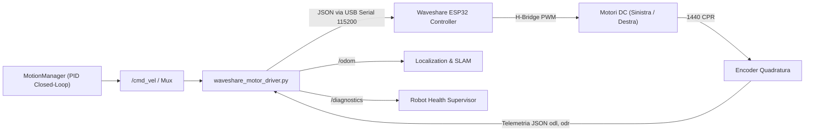

# 🚗 SPEC-01: Chassis, Attuazione, Motori & Cinematica

## 1. Identificazione e Scopo
- **ID Specifica:** `SPEC-01`
- **Ambito:** Controllo a basso livello dei motori, odometria da encoder, cinematica differenziale e servocomandi.
- **Nodi & Moduli ROS 2:**
  - `robopy_controller.nodes.waveshare_motor_driver` (`waveshare_motor_driver.py`)
  - `robopy_controller.robot_ai.motion` (`motion_manager.py`, `motion_primitive.py`, `motion_sequence.py`)
  - `robopy_controller.nodes.servo_coda_node` (`servo_coda_node.py`)
- **Hardware Diretto:** Scheda Waveshare General Driver (ESP32), 2x Motori DC con encoder magnetici a quadratura (1440 tick/giro), Batteria LiPo 3S, Servo bus PWM coda.
- **Interfaccia Seriale:** `/dev/motor_driver` (symlink udev persistente a 115200 baud, 8N1 su chip CP2102N seriale `4c7fd634626cef11acaca4adc169b110`).
- **DFMEA Correlati:** `FM-MOT-001` (Perdita comando di stop / Runaway), `FM-MOT-002` (Stallo meccanico motori), `FM-MOT-003` (Conflitto DTR/RTS e reset USB), `FM-MOT-004` (Collisione seriale con LiDAR C1 risolta con udev rules), `FM-NAV-015` (Slittamento ruote e corruzione calibrazione scala).

---

## 2. Architettura del Controllo



---

## 3. 🔴 ZONA ROSSA (Inviolabili - NO AUTONOMOUS TOUCH)

Qualsiasi modifica automatica ai seguenti parametri o logiche è severamente proibita per prevenire danni meccanici, incendi elettrici o fughe cinetiche.

| Parametro / Vincolo | Valore Limite Inviolabile | Rischio Fisico / Meccanico | DFMEA |
| :--- | :--- | :--- | :--- |
| **Watchdog Timeout Comandi** | **500 ms** (Se assente `/cmd_vel`, stop forzato) | Corsa incontrollata del robot (*runaway*) in caso di freeze ROS | FM-MOT-001 |
| **Velocità Lineare Massima** | $v_{max} = \mathbf{0.40\text{ m/s}}$ | Collisione ad alta energia, ribaltamento o perdita passo SLAM | FM-MOT-001 |
| **Velocità Angolare Massima** | $\omega_{max} = \mathbf{1.80\text{ rad/s}}$ | Smarrimento istantaneo dell'odometria ottica OAK-D Lite | FM-VIS-001 |
| **Reset Hardware DTR/RTS** | DTR=True/RTS=True per 0.1s, boot wait 3.0s | Blocco in bootloader o stato inconsistente dell'ESP32 | FM-MOT-003 |
| **Baud Rate Porta Seriale** | **115200 bps** fisso su `/dev/ttyUSB0` | Perdita totale di telemetria e controllo motori | FM-MOT-003 |
| **Risoluzione Encoder Fisici** | **1440 CPR** nominali per ruota | Errore catastrofico di scala metrica su `/odom` | FM-MOT-002 |
| **Arresto Emergenza Stallo** | Encoder $\approx 0$ per $> 1.0\text{ s}$ con comando attivo | Bruciatura avvolgimenti motori o fusione driver H-Bridge | FM-MOT-002 |
| **Protezione Tensione Motori** | Drop tensione $> 2.0\text{ V}$ innesca stop immediato | Scarica distruttiva della batteria LiPo e brownout Pi 5 | FM-SYS-003 |

---

## 4. 🟢 ZONA VERDE (Auto-Evolution - MIGLIORAMENTO AUTONOMO CONSENTITO)

L'agente Antigravity può ottimizzare e ricalibrare autonomamente le seguenti componenti:

| Area di Ottimizzazione | Metodo & Logica Ammessa | Range & Vincoli di Accettazione |
| :--- | :--- | :--- |
| **Guadagni PID MotionManager** | Tuning anello closed-loop per spostamenti relativi a target | $K_p \in [0.8, 2.5]$, $K_i \in [0.0, 0.2]$, $K_d \in [0.01, 0.15]$ |
| **Compensazione Tensione** | Scaling $PWM_{comp} = PWM \times (11.10\text{V} / V_{eff})$ | $V_{eff} \in [9.9\text{V}, 12.6\text{V}]$; Limitatore 50% sotto 10.2V |
| **Slew Rate / Jerk Limiter** | Rampa morbida per accelerazioni lineari/angolari | Rampa min: $0.15\text{ s}$, max: $0.50\text{ s}$ per evitare impuntamenti |
| **Calibrazione Encoder (Slip Gating)**| Raffinamento $R_{wheel}$ e $W_{separation}$ via closed-loop VIO | Blocco calibrazione se accelerazione $\Delta a > 0.25\text{ m/s}^2$ |
| **Espressività Servo Coda** | Profili PWM angolari, velocità sweep, scodinzolio | Angolo $\theta_{servo} \in [-45^\circ, +45^\circ]$; frequenza $\le 3\text{ Hz}$ |
| **Filtraggio Outlier Encoder** | Scarto delta-tick anomali causati da wrap o noise | Scarto se $\Delta tick > 300$ in $50\text{ ms}$ ($\approx 1.2\text{ m/s}$) |

---

## 5. 🟡 ZONA GIALLA (Human-in-the-Loop - APPROVAZIONE UMANA OBBLIGATORIA)

Le seguenti modifiche richiedono proposta formale e validazione dell'operatore umano:

1. **Alterazione Parametri Meccanici Fondamentali:** Variazione strutturale del diametro ruote nominale ($D = 65\text{ mm}$) o dell'interasse meccanico nominale ($W = 145\text{ mm}$).
2. **Flashing o Modifica Firmware ESP32:** Aggiornamento del firmware compilato su microcontrollore (`esphome compile`, C++ source ESP-IDF).
3. **Modifica Multiplexer Comandi:** Riconfigurazione dei layer e delle priorità su `cmd_vel_mux` (priorità 0 deve rimanere inviolabile per la sicurezza).
4. **Cambio Mappatura Seriale:** Spostamento del device seriale da `/dev/ttyUSB0` ad altre porte o bus hardware (UART GPIO).

---

## 6. Procedura di Verifica & Test di Non-Regressione

Prima di confermare modifiche alla cinematica o all'attuazione, l'agente DEVE eseguire con successo:

```bash
# 1. Test unitario della cinematica differenziale e watchdog
pytest tests/test_waveshare_motor_driver.py -v

# 2. Test simulato dell'anello chiuso MotionManager
pytest tests/test_motion_manager.py -v

# 3. Test della robustezza allo stallo e al wheel-slip gating
pytest tests/test_wheel_slip_gating.py -v
```
I test devono confermare:
- Interruzione dell'invio velocità entro 500ms al mancare del heartbeat.
- Nessun superamento del tetto $0.40\text{ m/s}$ indipendentemente dal valore su `/cmd_vel`.
- Corretta pubblicazione del diagnostico `ERROR` su stallo o sovraccarico.
