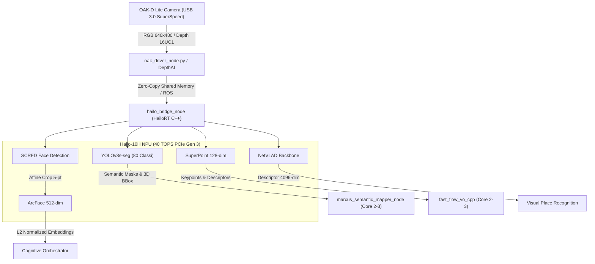

# 👁️ SPEC-03: Visione Computazionale, OAK-D Lite & NPU Hailo-10H

## 1. Identificazione e Scopo
- **ID Specifica:** `SPEC-03`
- **Ambito:** Acquisizione immagini stereo RGB-D, elaborazione ad alte prestazioni su NPU Hailo-10H (PCIe Gen 3), rilevamento oggetti YOLO, feature extraction SuperPoint, biometria facciale (SCRFD + ArcFace) e localizzazione globale NetVLAD.
- **Nodi & Moduli ROS 2:**
  - `robopy_controller.nodes.hailo_bridge_node` (`hailo_bridge_node.py` e C++ High-Perf `<hailo/hailort.hpp>`)
  - `src/marcus_semantic_mapper_node.cpp` (Back-projection geometrica C++)
  - `robopy_controller.nodes.oak_driver_node` (`oak_driver_node.py`, DepthAI)
  - `robopy_controller.nodes.dynamic_camera_tf_node`
- **File Modelli HEF / HAR:**
  - `joined_yolo_superpoint_netvlad.hef`, `yolov8s_seg.hef`, `superpoint_128d.hef`
- **Hardware Diretto:** OAK-D Lite (MyriadX), Raspberry Pi AI HAT+ (Hailo-10H NPU da 40 TOPS), Hub USB 3.0 alimentato.
- **DFMEA Correlati:** `FM-VIS-001` (Saturazione USB 2.0 e `X_LINK_ERROR`), `FM-VIS-004` (Caduta tensione e reset SSD), `FM-VIS-005` (API Hailo legacy non implementate), `FM-VIS-006` (Contesa CPU senza Core Pinning), `FM-LLM-005` (Fallback VLM su NPU).

---

## 2. Architettura della Pipeline di Visione



---

## 3. 🔴 ZONA ROSSA (Inviolabili - NO AUTONOMOUS TOUCH)

Le seguenti prescrizioni sono necessarie per prevenire crash del bus PCIe, disconnessioni hardware e freeze dell'host.

| Vincolo Hardware / Software | Regola Inviolabile | Rischio Ingegneristico | DFMEA |
| :--- | :--- | :--- | :--- |
| **Connettività OAK-D Lite** | **Porta USB 3.0 SuperSpeed (Blu)** obbligatoria | `X_LINK_ERROR` e crash loop dopo 60 secondi di streaming | FM-VIS-001 |
| **Alimentazione USB & SSD** | **Hub USB alimentato esternamente** per camera | Reset hardware dell'SSD host con filesystem in read-only | FM-VIS-004 |
| **CPU Core Pinning C++** | Vincolo categorico ai **Core CPU 2 e 3** su Pi 5 | Trashing della CPU; blocco thread real-time I/O (Core 0-1) | FM-VIS-006 |
| **Zero Allocazioni in Callback** | Strutture dati e buffer Eigen rigorosamente pre-allocati | Garbage collection pauses e latenze oltre i 100 ms | FM-SYS-001 |
| **Hailo-10H API Standard** | Solo `InferModel` via `VDevice.create_infer_model` | `HAILO_NOT_IMPLEMENTED` immediato su chiamate legacy | FM-VIS-005 |
| **Normalizzazione L2 Biometria**| Divisione obbligatoria per norma euclidea di ArcFace | Distorsione coseno: falsi riconoscimenti biometrici | FM-VIS-007 |

---

## 4. 🟢 ZONA VERDE (Auto-Evolution - MIGLIORAMENTO AUTONOMO CONSENTITO)

L'agente Antigravity può ottimizzare e ricalibrare autonomamente le seguenti componenti:

| Area di Ottimizzazione | Metodo & Logica Ammessa | Range & Vincoli di Accettazione |
| :--- | :--- | :--- |
| **Soglia Confidenza YOLO** | Filtraggio box per persone, ostacoli e mobili | $conf \in [0.45, 0.75]$; default: $0.55$ |
| **Soglia NMS Bounding Box** | Soppressione dei duplicati sovrapposti | $IoU \in [0.35, 0.60]$; default: $0.45$ |
| **Soglia Riconoscimento Volti**| Validazione identità persona su similarità coseno ArcFace| Soglia match: $thresh \in [0.68, 0.82]$; default: $0.72$ |
| **Lazy Publishing Debug** | Pubblicazione immagini annotate solo se ci sono subscriber | Se `count_subscribers(topic) == 0`, saltare `cv2.putText` e serialize |
| **NetVLAD Pooling CPU** | Calcolo soft-assignment e GeM pooling in NumPy/C++ | Latenza totale di pooling $< 1.5\text{ ms}$ su CPU host |
| **Dynamic Enrollment Volti** | Raccolta 10 frame consecutivi, media vettoriale e save `.npy` | Scarto campioni con $IoU < 0.60$ o illuminazione anomala |

---

## 5. 🟡 ZONA GIALLA (Human-in-the-Loop - APPROVAZIONE UMANA OBBLIGATORIA)

Le seguenti modifiche richiedono proposta formale e validazione dell'operatore umano:

1. **Sostituzione o Ricompilazione File HEF:** Modifica dei pesi di rete o rigenerazione dei modelli tramite `hailo compiler` / `hailo join`.
2. **Configurazione Bus PCIe:** Alterazione dei flag PCIe Gen 2 / Gen 3 all'interno di `/boot/firmware/config.txt`.
3. **Risoluzione Stream RGB primario:** Cambio della risoluzione nativa del sensore ottico (es. passaggio a 1080p completo che saturerebbe il bus).
4. **Attivazione Modelli VLM su NPU:** Deployment di Qwen2-VL-1.5B locale su Hailo GenAI VDevice (richiede verifica rigorosa dell'impronta termica).

---

## 6. Procedura di Verifica & Test di Non-Regressione

Prima di confermare modifiche alla pipeline di visione o ai driver NPU, l'agente DEVE eseguire con successo:

```bash
# 1. Test unitario del bridge NPU e parsing tensori
pytest tests/test_hailo_bridge.py -v

# 2. Test dell'allineamento landmark SCRFD e normalizzazione ArcFace
pytest tests/test_face_recognition_pipeline.py -v

# 3. Test della feature extraction SuperPoint e stima VIO
pytest tests/test_superpoint_matcher.py -v

# 4. Verifica del lazy publishing (risparmio CPU a subscriber zero)
pytest tests/test_lazy_publishing_guard.py -v
```
I test devono confermare:
- Normalizzazione unitaria rigorosa ($\|v\|_2 = 1.0 \pm 10^{-5}$) degli embedding estratti.
- Consumo CPU nullo sui Core 0-1 durante il processing NPU.
- Assenza di chiamate bloccanti non gestite in caso di frame corrotti o persi.
