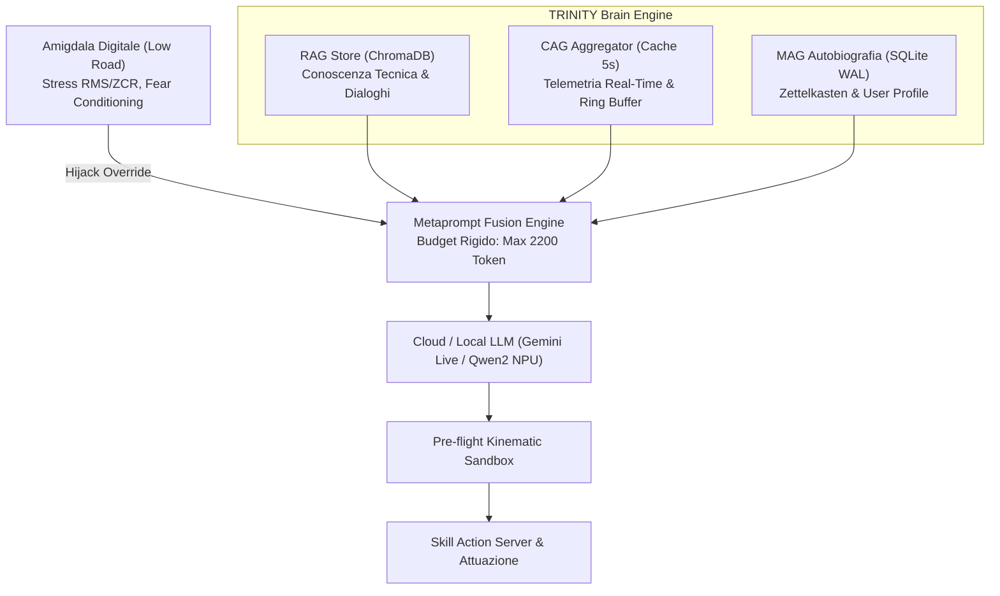

# 🧠 SPEC-05: Cervello Cognitivo TRINITY (RAG, CAG, MAG) & Skills

## 1. Identificazione e Scopo
- **ID Specifica:** `SPEC-05`
- **Ambito:** Architettura triadica di cognizione e memoria (TRINITY), fusione deterministica del contesto (Metaprompt Fusion), memoria autobiografica SQLite WAL, database vettoriale ChromaDB, Amigdala Digitale (Fear Conditioning & Emergency Hijack) e catalogo Skill.
- **Nodi & Moduli ROS 2 / Python:**
  - `robopy_controller.robot_ai.trinity` (`trinity_engine.py`, `cag_aggregator.py`, `mag_database.py`, `mag_zettelkasten.py`, `mag_user_profile.py`, `metaprompt_fusion.py`, `mag_dream_consolidation.py`)
  - `robopy_controller.robot_ai.cognitive` (`amygdala.py`, `default_mode_network.py`)
  - `robopy_controller.robot_ai.rag` (`chroma_native_store.py`)
  - `robopy_controller.robot_ai.skills` (`skill_registry.py`, `homeassistant_skill.py`, `navigation_skill.py`)
- **Database & Storage:**
  - SQLite WAL (`mag_database.db`), ChromaDB vettoriale (`chroma_db/`), Zettelkasten fatti persistenti.
- **DFMEA Correlati:** `FM-TRI-001` (Architettura TRINITY), `FM-COG-001` (Omeostasi dopaminica), `FM-COG-002` (Recupero RAG e identità), `FM-LLM-001` (Esplosione token e OOM), `FM-LLM-004` (Sandbox cinematico delle skill).

---

## 2. Architettura Triadica TRINITY



---

## 3. 🔴 ZONA ROSSA (Inviolabili - NO AUTONOMOUS TOUCH)

Le seguenti prescrizioni sono categoriche. La loro alterazione induce crash per saturazione del contesto o esecuzioni fisiche pericolose non controllate.

| Vincolo Cognitivo / Memoria | Regola Inviolabile | Rischio Ingegneristico | DFMEA |
| :--- | :--- | :--- | :--- |
| **Budget Massimo Token** | **Tetto assoluto: 2500 token** (target 2200 token) | Latenze oltre 5s, timeout WebSocket e OOM Kill host | FM-LLM-001 |
| **Journaling SQLite WAL** | Obbligo modalità **WAL + synchronous = NORMAL** | Corruzione fatale del database autobiografico al blackout | FM-TRI-001 |
| **Amigdala Emergency Hijack** | Override immediato del moto su anomalie o panico | Incapacità del robot di fermarsi durante allucinazioni LLM | FM-COG-001 |
| **Pre-flight Skill Sandbox** | Nessun comando a `/cmd_vel` senza validazione cinematica | Esecuzione di traiettorie distruttive o fuori dai muri | FM-LLM-004 |
| **Esclusione File Segreti RAG**| Divieto di indicizzare `.env`, `secrets.yaml` e chiavi | Fuga di credenziali API private durante le risposte vocali | - |
| **Limiti Vettoriali LRU** | Cache vettoriale limitata a **massimo 64 elementi** | Esaurimento silenzioso dei 4GB di RAM del Pi 5 | FM-SYS-008 |

---

## 4. 🟢 ZONA VERDE (Auto-Evolution - MIGLIORAMENTO AUTONOMO CONSENTITO)

L'agente Antigravity può ottimizzare e ricalibrare autonomamente le seguenti componenti:

| Area di Ottimizzazione | Metodo & Logica Ammessa | Range & Vincoli di Accettazione |
| :--- | :--- | :--- |
| **Cache Telemetria CAG** | Frequenza di polling telemetria hardware e nodi ROS | Intervallo cache: $T_{cache} \in [3.0\text{ s}, 8.0\text{ s}]$; default: $5.0\text{ s}$ |
| **Decay Sinaptico Ebbinghaus**| Parametro di potatura memorie nel Sogno Notturno | Costante $\lambda_{decay} \in [0.01, 0.08]$; preservare `amygdala_protected` |
| **Hybrid Search Fusion (RRF)**| Peso relativo tra ranking BM25 e somiglianza coseno | $K_{rrf} \in [40, 80]$; combinazione normalizzata [0, 1] |
| **Deduplicazione Zettelkasten**| Soglia di matching semantico per accorpare fatti | Soglia similarità coseno: $thresh \in [0.82, 0.92]$; default: $0.85$ |
| **Nuove Skill Applicative** | Implementazione integrazioni (HA, meteo, timer, domotica)| Aderenza interfaccia `BaseSkill`; 100% unit test con mock |
| **Prompt Synthesis Refactoring**| Compressione semantica sezioni metaprompt per risparmio token | Risparmio verificato tramite tokenizzatore; zero perdite semantiche |

---

## 5. 🟡 ZONA GIALLA (Human-in-the-Loop - APPROVAZIONE UMANA OBBLIGATORIA)

Le seguenti modifiche richiedono proposta formale e validazione dell'operatore umano:

1. **Alterazione Schema Database SQLite:** Aggiunta, rimozione o modifica delle colonne e chiavi esterne in `mag_database.py`.
2. **Personalità e Ruolo Primario:** Modifica delle istruzioni fondamentali di identità (`[RUOLO DEL ROBOT]`) in `metaprompt_fusion.py`.
3. **Pianificazione Sogno Notturno:** Variazione dell'orario di attivazione del dream consolidation daemon (default 03:00).
4. **Accesso Skill ad I/O Esterno:** Aggiunta di skill con facoltà di eseguire chiamate di rete non autorizzate verso endpoint esterni arbitrari.

---

## 6. Procedura di Verifica & Test di Non-Regressione

Prima di confermare modifiche alla pipeline cognitiva o alle skill, l'agente DEVE eseguire con successo:

```bash
# 1. Test unitario dell'architettura TRINITY e Metaprompt Fusion
pytest tests/test_trinity_engine.py -v

# 2. Test del token budget e allocazione dinamica
pytest tests/test_metaprompt_fusion.py -v

# 3. Test dell'Amigdala e logica di Hijack/Fear Conditioning
pytest tests/test_amygdala.py -v

# 4. Test di persistenza, indici FTS5 e robustezza crash SQLite WAL
pytest tests/test_mag_database.py -v
```
I test devono confermare:
- Metaprompt strettamente contenuto sotto i 2500 token anche a pieno carico telemetrico.
- Blocco immediato del comando di moto se l'Amigdala è in stato `HIJACK`.
- Recupero trasparente e senza corruzioni del database SQLite dopo terminazioni simulate brusche.
