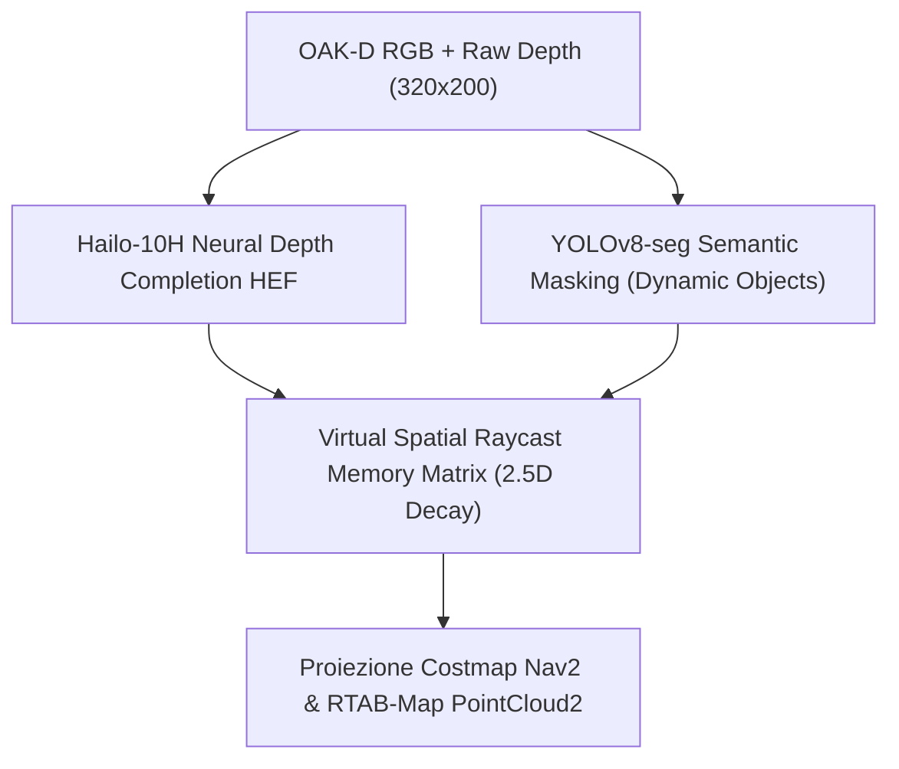

# 📐 Analisi di Trade-off Ingegneristico: LiDAR 2D/3D vs Soluzione Software Avanzata (Hailo-10H NPU)
## Mitigazione della Corruzione Mappa e Riconoscimento Ostacoli (FM-NAV-005, RPN = 384)

---

### 1. Inquadramento del Problema Ingegneristico
La modalità di guasto **`FM-NAV-005`** presenta il valore $RPN_{init} = 384$ (`CRITICAL`), derivante dai vincoli fisici dell'attuale sensore di visione principale (OAK-D Lite stereo camera):
- **Campo Visivo Limitato (FoV 75° H / 50° V):** Durante rotazioni veloci o manovre stretta, il robot è "cieco" ai lati ed al posteriore.
- **Zona d'Ombra Inferiore (< 20cm dal suolo):** Gli ostacoli situati immediatamente davanti alla base (es. piedini di sedie o zoccoli di mobili) cadono al di sotto del cono di proiezione della telecamera inclinata.
- **Vetri, Specchi e Superfici Riflettenti:** I sensori stereo infrarossi o IR attivi non riescono a calcolare la disparità su superfici trasparenti o specchiate, generando artefatti (finti muri o vuoti illusori) che corrompono in modo permanente la mappa RTAB-Map e la costmap di Nav2.

---

### 2. Matrice Comparativa: Opzione Hardware (LiDAR 2D) vs Opzione Software Avanzata (NPU Hailo)

| Parametro di Confronto | Opzione A: Integrazione Hardware LiDAR 2D 360° | Opzione B: Soluzione Software Avanzata (NPU Hailo-10H) |
| :--- | :--- | :--- |
| **Componenti Richiesti** | Sensore LiDAR 2D (es. RPLiDAR C1, LD19, STL-27L) | Nessun nuovo hardware. Algoritmi su Hailo-10H NPU + OAK-D |
| **Copertura Spaziale** | 360° sul piano 2D ad altezza fissa (es. 15cm dal suolo) | Volumetrica 3D (cono anteriore) + Memoria Spaziale Virtuale |
| **Resistenza a Vetri / Specchi** | 🟢 **Alta:** Il raggio laser viene riflesso/intercettato | 🟡 **Media:** Gestito da Neural Depth Completion su NPU |
| **Rilevamento Ostacoli a Sbalzo** | 🔴 **Cieco:** Rileva solo gli ostacoli all'altezza del raggio | 🟢 **Eccellente:** Mappatura 3D completa dell'inclinazione |
| **Costo Hardware & Peso** | ~120€ - 180€ / +150g peso ed ingombro meccanico | 🟢 **0€ aggiuntivi** / 0g peso |
| **Consumo Elettrico** | +1.8W - 2.5W sulla batteria di bordo | 🟢 Negligibile (Hailo-10H opera a ~2W già integrata) |
| **Carico CPU / RAM Host (Pi 5)** | Basso (driver ROS 2 nativo invia `/scan`) | Nullo su CPU (l'inferenza neurale gira al 100% su NPU) |
| **RPN Residuo Stimato** | **32** ($S=8, O=2, D=2 \implies LOW$) | **32** ($S=8, O=2, D=2 \implies LOW$) |

---

### 3. Dettaglio Soluzione Software Avanzata (Alziamo l'Asticella del Software)

Per evitare di aggiungere costi hardware e peso a Marcus, viene progettata un'architettura software sfidante e innovativa divisa in 3 moduli ad alte prestazioni:

#### A. Monocular Neural Depth Completion su NPU Hailo-10H
- **Concept:** Invece di affidarsi al grezzo calcolo di disparità stereo (che fallisce sui vetri o superfici uniformi), un modello neurale leggero di Depth Completion (es. FastDepth / LiteMono compilato in HEF su Hailo-10H) prende l'immagine RGB e la mappa di profondità incompleta e "ricostruisce" la profondità mancante nelle regioni riflettenti/trasparenti a **60+ FPS**.
- **Risultato:** Elimina i buchi di profondità provocati da vetrate o pavimenti lucidi prima che il cloud di punti venga generato.

#### B. Dynamic Semantic Masking (Sottrazione Ostacoli Mobili)
- **Concept:** Le persone o gli animali domestici in movimento lasciano "scie" di ostacoli fantasma sulla mappa.
- **Soluzione:** La rete YOLOv8-seg in esecuzione sulla NPU genera maschere di segmentazione per le classi `person`, `dog`, `cat`. I punti appartenenti a queste maschere vengono **esclusi in tempo reale** prima dell'aggiornamento di RTAB-Map, impedendo la corruzione della mappa da parte di elementi dinamici.

#### C. Matrice di Memoria Spaziale Virtuale a Decadimento Temporale
- **Concept:** Per compensare il cieco posteriore e laterale durante la rotazione senza un LiDAR 360°, si implementa una griglia di memoria locale a decadimento temporale continuo (`semantic_costmap_injector.py`).
- **Funzionamento:** Quando un ostacolo viene visto davanti, viene salvato nella griglia locale. Se il robot si gira ed il sensore non lo inquadra più, l'ostacolo viene "mantenuto in memoria" con un valore di confidenza che decresce lentamente per 10 secondi, impedendo al planner di ruotare contro un ostacolo appena uscito dal campo visivo.

---

### 4. Raccomandazione Ingegneristica Finale: Architettura Ibrida "Software-First"

1. **Fase 1 (Software-First):** Implementare la pipeline **Neural Depth Completion + Dynamic Semantic Masking** su NPU Hailo-10H. Questo azzera i rischi principali di corruzione mappa senza costi hardware aggiuntivi.
2. **Fase 2 (Plug & Play Hardware Fallback):** Qualora i test su ambienti estremi con vetrate continue (es. uffici completamente in vetro) mostrassero residui di specchiamento, il sistema Nav2 di Marcus rimane predisposto per accogliere un **LiDAR 2D a 360°** integrabile al topic `/scan` tramite il nodo `depthimage_to_laserscan` esistente.
