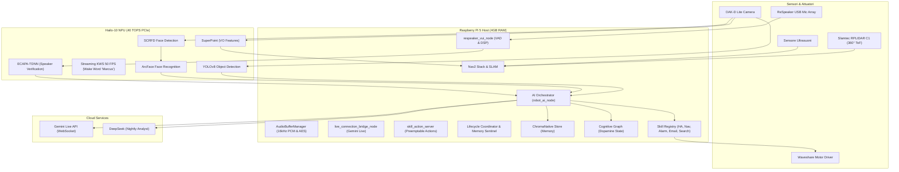

# 🤖 Marcus - Robot Capabilities & Architecture Guide

Questo documento descrive in dettaglio le capacità cognitive, motorie e visive di **Marcus**, l'architettura software residente su Raspberry Pi 5 con accelerazione Hailo-10 NPU, l'integrazione con i Large Language Models (LLM) in cloud e la roadmap per gli sviluppi futuri.

---

## 🎯 Visione & Obiettivi (Cosa fa Marcus)

Marcus è progettato per essere un **assistente domestico multimodale ed empatico**. Non è un semplice robot giocattolo, ma un agente intelligente in grado di:
1. **Comprendere l'ambiente domestico:** Mappare stanze, mobili e oggetti in 3D per muoversi e localizzarsi in sicurezza.
2. **Riconoscere gli abitanti della casa:** Identificare volti (Face Recognition) e voci (Speaker Verification) per adattare la propria personalità, preferenze e segreti a ciascun membro della famiglia.
3. **Controllare la Smart Home:** Interagire nativamente con Home Assistant per accendere luci, controllare la temperatura, avviare elettrodomestici o riprodurre musica.
4. **Fornire assistenza proattiva:** Ricordare impegni, leggere e filtrare email importanti, calcolare riassunti delle interazioni quotidiane e fare "sogni cognitivi" notturni per riordinare la propria memoria a lungo termine.

---

## ⚙️ Architettura di Sistema

---

## 🏃‍♂️ Attuazione & Navigazione (Come si muove)

Marcus si muove su una base mobile differenziale, gestendo il movimento e la mappatura in modo robusto tramite ROS 2:

* **Controllo Motori e Telemetria:** Il nodo `waveshare_motor_driver` comunica via seriale persistente (`/dev/motor_driver` con fallback `/dev/ttyUSB0`) con la board motori ESP32. Riceve comandi di velocità lineare/angolare `/cmd_vel` e pubblica i dati di odometria `/odom_wheel` (o `/odom`) calcolati dagli encoder delle ruote (1440 tick per rivoluzione). Supporta la calibrazione dinamica closed-loop (tramite la skill `calibration` V2) confrontando la posa reale di `/vo/odom` con la posa stimata di `/odom` per auto-calibrare il raggio ruota (`wheel_radius`) e la traccia (`wheel_separation`) sotto il 2% di errore residuo.
* **Architettura di Movimento Relativo (`MotionManager` & Controllo Closed-Loop PID):** Il pacchetto `robot_ai.motion` (`MotionPrimitive`, `MotionSequence`, `MotionManager`) fornisce l'ossatura cinematico-temporale e l'anello di controllo PID closed-loop agganciato all'odometria reale degli encoder (`/odom`) per l'esecuzione di comandi di movimento diretto a distanza e angolo (es. *"muoviti in avanti di 30cm"*, *"gira a sinistra di 90 gradi"*, *"spostati indietro di 0.5 metri"*). Se il robot incontra resistenza nei piccoli movimenti, l'anello PID incrementa dinamicamente la velocità e la coppia erogata finché l'odometria non misura l'esatto raggiungimento del target.
* **Sicurezza Attiva & Diagnostica Chassis:** Il driver motori monitora costantemente lo stato del movimento per prevenire collisioni e sovraccarichi:
  * *Stallo meccanico:* se viene impartito un comando di moto ma le ruote non girano (velocità da encoder $\approx 0$ per $> 1.0$ s).
  * *Slittamento/Ostacolo:* se le ruote girano ma il robot è fermo visivamente rispetto allo SLAM (velocità visiva $v_{vo} < 0.008$ m/s per $> 1.0$ s).
  * *Sovraccarico elettrico:* se si registra una caduta di tensione della batteria $> 2.0$ V rispetto allo stato di riposo (corrispondente a un picco anomalo di assorbimento).
  Al rilevamento di una di queste condizioni, viene pubblicato uno stato `ERROR` sul topic `/diagnostics` (nodo `motor_stall`). L'orchestratore AI intercetta il diagnostico, attiva l'arresto di emergenza (`emergency_stop()`) e avverte l'utente vocalmente.
* **LiDAR Planare a 360° Slamtec RPLIDAR C1 (`sllidar_node`):** Sensore Time-of-Flight (ToF) a 360° operante su `/dev/rplidar` a 460800 baud (10 Hz, 5 kHz sample rate, raggio 16 metri). Fornisce la copertura metrica 2D continua a 360° per le costmap di Nav2 (annullando ogni punto cieco in retromarcia e rotazione) e lo scan-matching geometrico ICP ad alta frequenza per lo SLAM.
* **SLAM e Localizzazione Ibrida Multi-Sensore:** Utilizza **RTAB-Map** (`rtabmap_slam`) per generare e mantenere mappe d'ambiente 2D/3D con fusione duale (`Grid/Sensor: 2` Both, `Reg/Strategy: 2` Visual + ICP):
  * *Scan Matching Laser 2D ICP:* Allinea real-time ogni scansione laser del LiDAR C1 per correggere millimetricamente l'orientamento yaw e la traslazione metrica.
  * *Loop Closure Visivo DBoW3:* Riconoscimento globale di landmark e chiusura di anelli complessi da telecamera OAK-D Lite (`Kp/DetectorStrategy: 8`). Include filtri anti-aliasing percettivo con soglia di similarità rafforzata (`Rtabmap/LoopThr: 0.20`), tolleranza PnP a 2.5px e maschera ROI del pavimento (`Kp/RoiRatios: 10%`).
* **Odometria Visivo-Inerziale & Robustezza (`fast_flow_vo_cpp` & `localization_fuser_node`):** Fusione locale ad alta frequenza (30-50 Hz) che unisce la dinamica lineare degli encoder ruote con l'heading immediato del giroscopio BMI270 a 200 Hz (con compensazione dinamica del pitch sag a $8^\circ$) e la stima VIO di MyriadX. Non usa `robot_localization` EKF per prevenire blocchi o deadlock storici da flag IMU non conformi (`FM-NAV-004`).
* **Supervisor di Sicurezza & Interlock Hardware ESP32:** Il nodo `robot_health_supervisor.py` valuta continuativamente le soglie di confidenza VIO, temperatura CPU, occupazione RAM e tensione batteria nei tre stati GREEN, YELLOW e RED. In caso di anomalie critiche (RED) o perdita del sensore di visione ($>300\,\text{ms}$), emette una frenata attiva a Priorità 0 su `/cmd_vel_mux/input/safety_override`. A livello hardware, l'ESP32 gestisce in autonomia 3 sensori ad ultrasuoni e paraurti meccanici cablati direttamente ai bridge H per il freno di emergenza fisico in caso di distacco della telecamera.
* **Evitamento Ostacoli, Autocalibrazione & Auto-Consapevolezza (No STVL):**
  > [!IMPORTANT]
  > Per preservare la CPU e la RAM sul Raspberry Pi 5, **è vietato l'uso di STVL 3D**. Marcus proietta i dati visivi 3D in una **griglia 2.5D locale** con decadimento temporale tramite il nodo custom `semantic_costmap_injector.py`.
  * **Continuous Extrinsic Auto-Calibration & Self-Healing Camera Sag (`extrinsic_camera_calibrator.py`):** Sistema di auto-consapevolezza che rileva l'inclinazione (pitch sag) della OAK-D Lite dovuta alle vibrazioni meccaniche tramite regressione RANSAC del piano terra. Invia allarmi di diagnostica su `/diagnostics` e `/robot/health_status` (Consapevolezza), ed aggiorna a caldo il TF di inclinazione fotocamera e pulisce la costmap dai ghost obstacles (Sistemazione Proattiva).
  * **Rilevamento Ostacoli Negativi (Prevenzione Caduta Scale):** Algoritmo *Depth-Gradient Hole Raycasting* integrato in `semantic_costmap_injector.py` che scansiona la profondità della telecamera 3D per dislivelli ($\Delta Z > 15\text{ cm}$) ed inietta ostacoli letali in costmap prima che il robot possa cadere.
  * **Safe Recovery & Persistence Policy Nav2:** In caso di stallo in passaggi angusti, le costmap Nav2 operano con `combination_method: 1` (Maximum) e la sequenza di recupero (`nav2_survival_bt.xml`) evita rotazioni cieche a 90° sul posto, adottando un disimpegno lineare controllato da 8 cm e ripianificazione diretta.
* **Navigazione Autonoma Vision-Based (Modello Fondazionale NOMAD) & Nav2:**
  * *Pianificazione Visiva NOMAD (`nomad_navigator_node.py`):* Modello fondazionale di navigazione visiva NoMaD che opera direttamente dallo stream RGB dell'OAK-D Lite. Predice waypoint 2D ad orizzonte mobile a 4 Hz in modalità *Unconditioned Exploration* (esplorazione autonoma e scoperta di nuove aree) e *Goal-Conditioned Navigation* (verso landmark visivi memorizzati in ChromaDB), pilotando il robot con un controller Pure Pursuit locale direttamente su `/cmd_vel`. La costmap a 360° del LiDAR C1 funge da guardrail geometrico assoluto contro collisioni laterali e posteriori.
  * *Skill Esplorazione NOMAD (`NomadExplorationSkill`):* Consente all'utente di comandare vocalmente o via chat l'esplorazione (*"Marcus, esplora con NOMAD"*, *"Esplora la casa"*, *"Fai una ricognizione"*, *"Mappa la stanza"*, con tolleranza fonetica su varianti ASR) mappando in parallelo l'ambiente con RTAB-Map SLAM.
* **Gestione Alimentazione, Battery Management System (BMS) & Voltage Feed-Forward:**
  Marcus dispone di un'architettura di alimentazione a doppio binario (*Power Path OR-ing* tramite diodi ideali). Il nodo `battery_manager_node.py` gestisce:
  * *Rilevamento Carica/Rete:* Tensione di bus a **12.80V** ($V \ge 12.70\text{V}$) con isolamento della chimica batteria, inibizione di docking e allarmi, e pubblicazione di stato `"IN CARICA (12.8V)"` su Foxglove Studio.
  * *Filtro Anti-Sag & Persistenza (3s):* Media mobile circolare a 20 campioni (5Hz) con timer di persistenza a 3.0s per innescare solo allarmi reali di rientro cuccia (`/robot/docking/trigger` a 9.90V) ed arresto critico (`/robot/system/shutdown` a 9.00V).
  * *Compensazione Feed-Forward di Tensione:* Scaling continuo dei comandi di velocità ruote $PWM_{comp} = PWM \times (11.10\text{V} / V_{eff})$ per mantenere costante e lineare la dinamica motoria anche a batteria scarica, con limitatore dinamico al 50% in modalità ECO ($V \le 10.20\text{V}$).
  * *Demone OS Graceful Shutdown:* Protezione hardware attiva da battery cliff per salvare e sincronizzare in sicurezza i filesystem NVMe/SD prima dello stacco BMS.
* **Sicurezza Attiva:** Il modulo `reactive_safety.py` gestisce l'arresto d'emergenza in caso di rilevamento ostacolo immediato tramite il sensore a ultrasuoni (`ultrasonic_sensor`) o disconnessioni della telecamera.

---

## 💬 Interfaccia Vocale & Conversazione (VUI)

La Voice User Interface (VUI) è il canale primario di interazione di Marcus:

* **100% NPU Continuous Listening & Wakeword (Hailo-10H KWS):** Il motore commerciale Picovoice Porcupine è stato completamente rimosso dal workspace. L'ascolto sempre attivo della parola chiave "Marcus" è gestito localmente in hardware tramite modello Keyword Spotting (KWS) su NPU Hailo-10H.
* **DSP & VAD (Voice Activity Detection):** Il nodo `respeaker_vui_node.py` elabora l'audio dall'array microfonico USB ReSpeaker a 16kHz PCM a 16-bit. Include profilazione automatica del silenzio (noise floor subtraction), guadagno adattivo AGC (1.0x-4.0x con base 2.5x), filtro Passa-Alto Butterworth @ 140 Hz (HPF) per abbattere il ronzio della ventola del Pi 5, pre-roll ridotto a 500ms (latenza minima) e gate dinamico per la sensibilità far-field (1-3 metri).
* **Speaker Voice Print & Enrollment (`voiceprint_manager.py`):** Riconoscimento delle persone dal timbro vocale tramite l'estrazione di Speaker Embeddings su NPU (soglia di similarità coseno `>= 0.72`). Supporta l'Enrollment vocale via frase *"registra la mia voce come Luca"*.
* **Ambient Memory & Memory Decay Engine (`memory_decay_engine.py`):** Durante l'ascolto passivo, Marcus traccia le conversazioni dell'ambiente circostante. L'algoritmo di oblio (Memory Decay) elimina i rumori o le frasi futili preservando solo le informazioni salienti. Gli ultimi 3 minuti di ascolto passivo beneficiano di immunità temporale assoluta dal decay.
* **Context Handoff a Gemini Live API & Finestra Estesa a 3 Minuti:** L'interfaccia ed i colori dei LED rimangono inalterati. Al rilevamento di "Marcus", l'orchestratore avvia la sessione WebSocket bidirezionale con Gemini Live iniettando nel prompt iniziale il contesto ereditato dall'ascolto passivo recente. La sessione conversazionale rimane aperta e ricettiva per **3 minuti (180s)**: al primo turno risponde direttamente, mentre nei turni successivi di follow-up risponde vocalmente **solo a richieste indirizzate esplicitamente a lui** (es. *"Marcus dimmi..."*), sopprimendo silenziosamente il parlato su dialoghi di terzi o rumore (<IGNORE_TURN>) senza mai chiudere il canale.

---

## 🧠 Accelerazione Hardware (Hailo-10 NPU)

L'HAT Hardware Raspberry Pi AI HAT+ ospita una **Hailo-10 NPU** da 40 TOPS collegata via PCIe Gen 3. Gestita nativamente tramite il driver C++ High-Performance `hailo_bridge_node_cpp` (`<hailo/hailort.hpp>`), azzera l'overhead CPU (0% su Core 1) e supporta Lazy Publishing per la trasmissione di immagini annote. Marcus la sfrutta per eseguire reti neurali pesanti localmente a FPS elevati:

1. **YOLOv8-seg:** Rilevamento e segmentazione in tempo reale di 80 classi di oggetti comuni (persone, sedie, bottiglie, zaini) per popolare la memoria semantica.
2. **SuperPoint:** Estrattore di feature visive puntiformi integrato nel driver della telecamera per l'odometria visuale C++.
3. **NetVLAD (Backbone):** Modello di localizzazione globale (VPR) che permette al robot di riconoscere istantaneamente in quale stanza si trova. Il backbone di estrazione gira su NPU e il pooling (soft-assignment) viene eseguito in host CPU tramite NumPy/C++ per aggirare i limiti del compilatore, pubblicando descrittori a 4096 dimensioni su `/hailo/vpr/descriptor`.
4. **SCRFD + ArcFace (Sprint 3):** Rilevamento dei volti ultra-veloce (SCRFD) e calcolo degli embedding di identificazione a 512 dimensioni (ArcFace) eseguiti in meno di 10ms su NPU.
5. **Local VLM (Qwen2-VL) (Fase 3):** Vision-Language Model Qwen2-VL-1.5B integrato localmente tramite la suite Hailo GenAI, condividendo l'hardware con l'NPU bridge tramite un VDevice condiviso per consentire analisi visive ed esplorative completamente offline.
6. **ECAPA-TDNN (Speaker Verification):** Estrazione dell'impronta vocale (embedding 192-dim) per verificare chi sta parlando.

---

## 🧠 Il Cervello Cognitivo: Architettura Triadica TRINITY (RAG + CAG + MAG)

Marcus combina tre paradigmi armonizzati di memoria e contesto gestiti dal motore centrale **`TrinityEngine`** (`robopy_controller.robot_ai.trinity`):

1. **RAG (Knowledge & Code Retrieval):**
   * *Knowledge Base Locale (`marcus_knowledge_base`):* Indicizzazione e chunking intelligente di documenti tecnici, datasheet hardware, librerie e codice Python locale per rispondere a domande di programmazione e architettura.
   * *Memory Store Conversazionale (`chroma_native_store.py`):* Database vettoriale ChromaDB per il richiamo semantico dei dialoghi recenti e definizioni apprese.
2. **CAG (Context-Augmented Generation - "Qui ed Ora"):**
   * *Context Awareness in Tempo Reale (`cag_aggregator.py`):* Monitoraggio deterministico con cache a 5.0s di telemetria hardware (carico CPU 4-core, RAM libera, temperatura SoC, tensione batteria, stato rete), topologia dei nodi ROS 2, ring buffer degli ultimi 5 errori/traceback e snapshot ambiente (stanze VPR, volti/voci, oggetti YOLO, stato Home Assistant).
3. **MAG (Memory-Augmented Generation - Autobiografia & Persistenza):**
   * *Memoria Episodica Atomica (`mag_database.py`):* Database relazionale SQLite con journaling WAL e indici FTS5 per la persistenza sicura da blackout di ogni interazione e riassunto episodico.
   * *Zettelkasten Semantica (`mag_zettelkasten.py`):* Riconoscimento e deduplicazione (cosine similarity > 0.85) di fatti tecnici, configurazioni hardware e preferenze utente persistenti.
   * *User Profile Engine (`mag_user_profile.py`):* Tracciamento continuo del profilo, livello tecnico, preferenze di linguaggio/stile di ciascun utente.
   * *Hybrid Search (RRF):* Ricerca ibrida multi-modale che fonde full-text search BM25 ed embedding similarity.
4. **Metaprompt Fusion Engine (`metaprompt_fusion.py`):**
   * Assemblatore deterministico che orchestra le sezioni `[RUOLO DEL ROBOT]`, `[MEMORIA STORICA (MAG)]`, `[CONTESTO ATTUALE (CAG)]`, `[CONOSCENZA RECUPERATA (RAG)]` con token budgeting rigido (~2200 token) per prevenire saturazioni del context window.
5. **Nightly Dream (`nightly_dream_service.py` & `mag_dream_consolidation.py`):**
   * Alle 03:00 del mattino, Marcus consolida le memorie della giornata, esegue potatura sinaptica Ebbinghaus e archivia insight e fatti permanenti in SQLite.
6. **Skill Registry:** Catalogo dinamico di tool fisici (HomeAssistant, Navigation, Exploration, Alarms, Email, Terminal).

---

## 📈 Stato Attuale (Cosa funziona bene ora)

* **Mappatura Semantica e YOLO Real-Time:** Integrazione end-to-end delle rilevazioni YOLO reali dell'NPU Hailo-10H con la costmap Nav2 e il mapper C++ (Visual Fusion), dotata di stima 3D geometrica thread-safe e temporal decay dinamico degli ostacoli.
* **Riconoscimento Facciale Integrato:** Riconoscimento offline di estranei e persone della casa basato su NPU (SCRFD + ArcFace).
* **Enrollment Dinamico VUI (Volto):** Dicendo *"Marcus, ti presento Edoardo"*, il robot avvia una sessione di cattura automatica del volto, calcola la media degli embedding estratti su NPU, crea un profilo `.npy` robusto e inizia immediatamente a riconoscere Edoardo nei frame successivi.
* **Biometria Vocale (Speaker ID):** Riconoscimento dell'identità dell'utente semplicemente ascoltando la sua impronta vocale (192-dim embeddings), consentendo l'identificazione anche a robot di spalle.
* **Enrollment Dinamico VUI (Voce):** Dicendo *"Marcus, registra la mia voce come Luca"*, il robot avvia la sessione di cattura accumulando segmenti audio puliti, mediando e normalizzando i vettori di embedding vocali per poi salvarli come impronta permanente `.npy`.
* **Diagnostica Modelli Gemini & Fallback Locale Qwen NPU (`test_gemini_models.py`):** Script di supporto autonomo per verificare ed auto-scoprire i modelli Gemini per la Multimodal Live API (bidi-streaming con Native Audio). Previene blocchi dovuti a deprecazione o rinominamento dei modelli Cloud ed abilita il fallback automatico su Qwen2-VL (Hailo NPU).
* **DSP Audio Robust:** Il filtro passa-banda e l'algoritmo di residuo catturano frasi pulite anche con rumore di fondo domestico o durante la riproduzione TTS.
* **Bassi Consumi RAM/CPU:** LRU Cache ridotta a 64 vettori, uso di float16 reale, core pinning del bridge NPU sui core CPU 2 e 3 e limitazioni del contesto HA mantengono l'utilizzo di memoria stabilmente sotto il tetto critico dei 4GB.
* **Affidabilità Testata:** Test suite automatica locale ed eseguita su Raspberry Pi con pytest e script specifici (`test_sprint3.py` e `test_sprint4.py`).

---

## 🚀 Sviluppi Futuri (Roadmap)

### Sprint 5: Memory Decay Bio-Ispirato, Amigdala e DMN (Completato)
* **Obiettivo:** Implementare la curva dell'oblio di Ebbinghaus per la gestione della memoria ChromaDB ed il cervello cognitivo superiore.
* **Funzionalità:** 
  * Il sotto-modulo `robopy_controller/robot_ai/cognitive/` gestisce la dinamica sinaptica (`synaptic_strength`, `recall_count`, `lambda_decay`, `amygdala_protected`).
  * L'Amigdala Digitale esegue l'elaborazione rapida Low Road (RMS/ZCR per stress vocale, pericoli ambientali, anomalie hardware) ed applica l'Hijack (arresto ed interrupt) o l'Anxious Vigilance (riduzione velocità MPPI al 50% tramite Fear Conditioning).
  * Il Default Mode Network (DMN) estrae intenzioni proattive durante l'inattività del robot.
  * Il ciclo del Sogno Notturno esegue la potatura sinaptica fisica su ChromaDB liberando la memoria RAM.

### Sprint 6: Embedding Locali offline (Medio termine)
* **Obiettivo:** Eseguire `all-MiniLM-L6-v2` in formato ONNX ottimizzato localmente sulla CPU host tramite ONNX Runtime.
* **Funzionalità:** Permettere a Marcus di memorizzare e cercare nel proprio database di ricordi (RAG) in modo completamente offline senza dipendere dalle API Gemini cloud.

### Sinergia Multimodale (Lungo termine)
* **Obiettivo:** Fondere face embedding + speaker embedding in un punteggio di confidenza biometrico unico per prevenire spoofing ed impersonificazioni.

---

## 🛡️ Governance & Auto-Evoluzione con Antigravity

Per consentire l'evoluzione autonoma del codice di Marcus direttamente a bordo del Raspberry Pi 5 tramite l'agente **Antigravity (Gemini 3.8)**, l'architettura è regolata dalla suite di **Schede Tecniche di Sviluppo e Sicurezza** ([/docs/specs/INDEX_SCHEDE_TECNICHE.md](file:///c:/Users/lsuffia/OneDrive%20-%20BRUGOLA%20OEB%20INDUSTRIALE%20SPA/Documents/robopy/antigravity/docs/specs/INDEX_SCHEDE_TECNICHE.md)):
* 🔴 **Zona Rossa (Hard Constraints):** Vincoli fisici, limiti termici/elettrici, arresto nodi pre-build, compilazione sequenziale `colcon build -j1`, divieto STVL 3D e soglie BMS a 9.0V/9.9V inviolabili dall'agente. Zero forzature consentite sul robot.
* 🟢 **Zona Verde (Auto-Evolution):** Ottimizzazione autonoma di algoritmi interni, tuning iperparametri entro intervalli validati, prompt engineering TRINITY, caching e test unitari.
* 🟡 **Zona Gialla (Human Gate):** Modifiche a contratti ROS 2 (topics, services, action messages), pinout hardware o modelli compilati HEF, che richiedono approvazione umana esplicita.

---

## 🗣️ Dialogo Tecnico, Accesso Documentale & Creazione Skill con Feedback Vocale

Marcus può dialogare in linguaggio naturale con l'utente su qualsiasi aspetto della propria ingegneria:
1. **Accesso alla Documentazione Completa (`RobotDocumentationService` & `ConsultDocumentationSkill`):**
   * *DFMEA:* L'utente può chiedere *"Marcus, cosa dice la FMEA sui motori?"* o *"Quali sono i guasti con RPN più alto?"* ed ottenere una risposta immediata e dettagliata.
   * *ECO Storici:* *"Quali modifiche hai fatto in autonomia?"* Marcus recupera gli Engineering Change Order registrati con firma `🤖 Generata autonomamente da Marcus`.
   * *Schede Tecniche & Regole:* *"Quali sono i vincoli di Zona Rossa per la navigazione?"* o *"Cosa prevede la SPEC-05 sul budget dei token?"*.
   * *Lesson Learned:* *"Cosa abbiamo imparato sul campionamento audio a 16kHz?"*.
   * *File di Configurazione:* Marcus può leggere e spiegare qualsiasi file di codice o configurazione nel workspace (con divieto assoluto e perimetrale di aprire `.env` o `secrets.yaml`).
2. **Dialogo On-Demand con Antigravity (`ConsultAntigravitySkill`):**
   * Dicendo *"Marcus, chiedi ad Antigravity un parere su questa funzione"* o *"Cosa pensa Antigravity di questo errore?"*, Marcus apre una sessione di consultazione con Gemini 3.8 con extended thinking e spiega all'utente l'analisi tecnica fornita da Antigravity, come un collega che consulta uno specialista senior.
   * Rispetto rigoroso della quota a 4 ore (soglia 90%) per non esaurire il budget.
3. **Osservabilità Real-Time della Creazione Skill (`CreaSkill`):**
   * Quando l'utente chiede di creare o apprendere una nuova abilità (*"Marcus, crea una skill per controllare il meteo"*), il robot avvia la pipeline e comunica vocalmente e in tempo reale all'utente cosa sta accadendo:
     - *"Sto analizzando la tua richiesta per definire l'architettura della skill..."*
     - *"Ho aperto una sessione con Antigravity. Sta elaborando il codice Python con Gemini 3.8..."*
     - *"Antigravity ha completato la bozza. Ora eseguo la verifica di sicurezza statica AST..."*
     - *"Verifica superata. Procedo con il collaudo in sandbox simulata ROS..."*
     - *(Se c'è un intoppo):* *"Nel collaudo sandbox è emerso un problema (...). Sto chiedendo ad Antigravity di correggere la bozza..."*
     - *(Se la quota è satura al 90%):* *"Abbiamo raggiunto il 90% della quota token per questa sessione. Ho salvato il lavoro e lo riprenderò appena possibile."*
     - *"Fantastico! Il collaudo ha avuto successo ed ho registrato la nuova abilità nel mio sistema."*
   * In qualsiasi momento l'utente può chiedere: *"Marcus, a che punto è la creazione della skill?"* o *"Cosa sta facendo Antigravity?"* ed ottenere un aggiornamento istantaneo.
4. **Memoria Autobiografica Continua:**
   * Ogni skill creata o successo evolutivo viene fissato sia in `docs/evolution/evolution_journal.md` che nella tabella SQLite `episodes` e `semantic_facts` di MAG, permettendo a Marcus di ricordare e raccontare con autentico senso di continuità la propria storia e il proprio percorso di auto-miglioramento.

