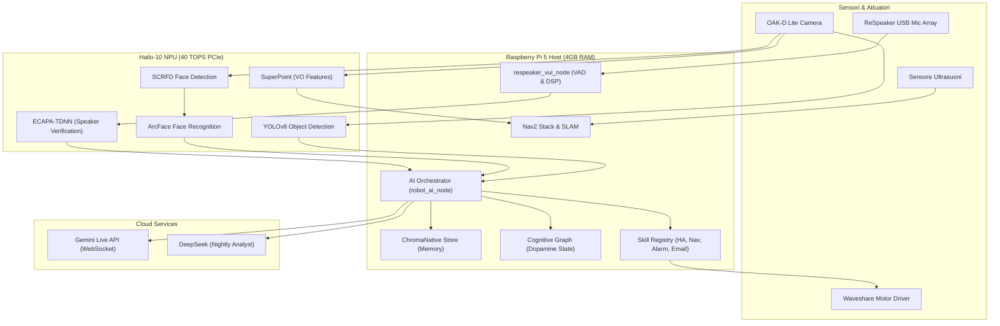

# 🤖 Marcus - Robot Capabilities & Architecture Guide

Questo documento descrive in dettaglio le capacità cognitive, motorie e visive di **Marcus**, l'architettura software residente su Raspberry Pi 5 con accelerazione Hailo-10 NPU, l'integrazione con i Large Language Models (LLM) in cloud e la roadmap per gli sviluppi futuri.

---

## 🎯 Visione & Obiettivi (Cosa fa Marcus)

Marcus è progettato per essere un **assistente domestico multimodale ed empatico**. Non è un semplice robot giocattolo, ma un agente intelligente in grado di:
1. **Comprendere l'ambiente domestico:** Mappare stanze, mobili e oggetti in 3D per muoversi e localizzarsi in sicurezza.
2. **Riconoscere gli abitanti della casa:** Identificare volti (Face Recognition) e voci (Speaker Verification) per adattare la propria personalità, preferenze e segreti a ciascun membro della famiglia.
3. **Controllare la Smart Home:** Interagire nativamente con Home Assistant per accendere luci, controllare la temperatura, avviare elettrodomestici o riprodurre musica.
4. **Fornire assistenza proattiva:** Ricordare impegni, leggere e filtrare email importanti, calcolare riassunti delle interazioni quotidiane e fare "sogni cognitivi" notturni per riordinare la propria memoria a lungo termine.

---

## ⚙️ Architettura di Sistema

---

## 🏃‍♂️ Attuazione & Navigazione (Come si muove)

Marcus si muove su una base mobile differenziale, gestendo il movimento e la mappatura in modo robusto tramite ROS 2:

* **Controllo Motori e Telemetria:** Il nodo `waveshare_motor_driver` comunica via seriale (`/dev/ttyUSB0`) con la board motori ESP32. Riceve comandi di velocità lineare/angolare `/cmd_vel` e pubblica i dati di odometria `/odom` calcolati dagli encoder delle ruote (1440 tick per rivoluzione). Supporta la calibrazione dinamica closed-loop (tramite la skill `calibration` V2) confrontando la posa reale di `/vo/odom` con la posa stimata di `/odom` per auto-calibrare il raggio ruota (`wheel_radius`) e la traccia (`wheel_separation`) sotto il 2% di errore residuo.
* **Architettura di Movimento Relativo (`MotionManager` & Controllo Closed-Loop PID):** Il pacchetto `robot_ai.motion` (`MotionPrimitive`, `MotionSequence`, `MotionManager`) fornisce l'ossatura cinematico-temporale e l'anello di controllo PID closed-loop agganciato all'odometria reale degli encoder (`/odom`) per l'esecuzione di comandi di movimento diretto a distanza e angolo (es. *"muoviti in avanti di 30cm"*, *"gira a sinistra di 90 gradi"*, *"spostati indietro di 0.5 metri"*). Se il robot incontra resistenza nei piccoli movimenti, l'anello PID incrementa dinamicamente la velocità e la coppia erogata finché l'odometria non misura l'esatto raggiungimento del target.
* **Sicurezza Attiva & Diagnostica Chassis:** Il driver motori monitora costantemente lo stato del movimento per prevenire collisioni e sovraccarichi:
  * *Stallo meccanico:* se viene impartito un comando di moto ma le ruote non girano (velocità da encoder $\approx 0$ per $> 1.0$ s).
  * *Slittamento/Ostacolo:* se le ruote girano ma il robot è fermo visivamente rispetto allo SLAM (velocità visiva $v_{vo} < 0.008$ m/s per $> 1.0$ s).
  * *Sovraccarico elettrico:* se si registra una caduta di tensione della batteria $> 2.0$ V rispetto allo stato di riposo (corrispondente a un picco anomalo di assorbimento).
  Al rilevamento di una di queste condizioni, viene pubblicato uno stato `ERROR` sul topic `/diagnostics` (nodo `motor_stall`). L'orchestratore AI intercetta il diagnostico, attiva l'arresto di emergenza (`emergency_stop()`) e avverte l'utente vocalmente.
* **SLAM e Localizzazione:** Utilizza **RTAB-Map** (`rtabmap_slam`) per generare mappe d'ambiente 2D/3D in modalità multi-sessione incrementale (`Mem/IncrementalMemory: true`) sfruttando l'estrazione visiva DBoW3 nativa C++ (`Kp/DetectorStrategy: 8`). Se spento e riacceso in una stanza diversa, avvia una nuova sessione autonoma per prevenire la corruzione delle mappe esistenti, consentendo il merge automatico in caso di loop closure. Supporta la scansione controllata della stanza tramite `room_mapping_scan_node` (720° in passi di 15° con pausa di 5s per cattura nitida di keyframe visivi).
* **Odometria Visivo-Inerziale & Fusore Dedicato (`localization_fuser_node.py`):** Il fusore gestisce l'integrazione differenziale ruote/VIO calcolando la confidenza VIO su `/vins/quality_metrics` ($C \in [0, 100]$), la modulazione sigmoide della covarianza con saturazione rigida $R_{max} = 100 \cdot R_{base}$, il tracciamento dinamico dello slittamento ruote ($\left| \omega_{ruote} - \omega_{IMU} \right| > 0.25\,\text{rad/s}$) ed il piano pavimento inclinato a 200 Hz.
* **Supervisor di Sicurezza & Interlock Hardware ESP32:** Il nodo `robot_health_supervisor.py` valuta continuativamente le soglie di confidenza VIO, temperatura CPU, occupazione RAM e tensione batteria nei tre stati GREEN, YELLOW e RED. In caso di anomalia critiche (RED) o perdita del sensore di visione ($>300\,\text{ms}$), emette una frenata attiva a Priorità 0 su `/cmd_vel_mux/input/safety_override`. A livello hardware, l'ESP32 gestisce in autonomia 3 sensori ad ultrasuoni e paraurti meccanici cablati direttamente ai bridge H per il freno di emergenza fisico in caso di distacco della telecamera.
* **Evitamento Ostacoli, Autocalibrazione & Auto-Consapevolezza (No STVL):**
  > [!IMPORTANT]
  > Per preservare la CPU e la RAM sul Raspberry Pi 5, **è vietato l'uso di STVL 3D**. Marcus proietta i dati visivi 3D in una **griglia 2.5D locale** con decadimento temporale tramite il nodo custom `semantic_costmap_injector.py`.
  * **Continuous Extrinsic Auto-Calibration & Self-Healing Camera Sag (`extrinsic_camera_calibrator.py`):** Sistema di auto-consapevolezza che rileva l'inclinazione (pitch sag) della OAK-D Lite dovuta alle vibrazioni meccaniche tramite regressione RANSAC del piano terra. Invia allarmi di diagnostica su `/diagnostics` e `/robot/health_status` (Consapevolezza), ed aggiorna a caldo il TF di inclinazione fotocamera e pulisce la costmap dai ghost obstacles (Sistemazione Proattiva).
  * **Rilevamento Ostacoli Negativi (Prevenzione Caduta Scale):** Algoritmo *Depth-Gradient Hole Raycasting* integrato in `semantic_costmap_injector.py` che scansiona la profondità della telecamera 3D per dislivelli ($\Delta Z > 15\text{ cm}$) ed inietta ostacoli letali in costmap prima che il robot possa cadere.
* **Navigazione Autonoma:** Gestita dallo stack **Nav2** (planner, controller e comportamento ad albero decisionale) che pianifica traiettorie sicure. Le destinazioni non sono rigide, ma risolte dinamicamente tramite interrogazione a ChromaDB (sia per stanze apprese `MemoryType.LOCATION` che per oggetti identificati recentemente `MemoryType.VISUAL_OBSERVATION` filtrati per l'active session ID).
* **Sicurezza Attiva:** Il modulo `reactive_safety.py` gestisce l'arresto d'emergenza in caso di rilevamento ostacolo immediato tramite il sensore a ultrasuoni (`ultrasonic_sensor`) o disconnessioni della telecamera.

---

## 💬 Interfaccia Vocale & Conversazione (VUI)

La Voice User Interface (VUI) è il canale primario di interazione di Marcus:

* **100% NPU Continuous Listening & Wakeword (Hailo-10H KWS):** Il motore commerciale Picovoice Porcupine è stato completamente rimosso dal workspace. L'ascolto sempre attivo della parola chiave "Marcus" è gestito localmente in hardware tramite modello Keyword Spotting (KWS) su NPU Hailo-10H.
* **DSP & VAD (Voice Activity Detection):** Il nodo `respeaker_vui_node.py` elabora l'audio dall'array microfonico USB ReSpeaker a 16kHz PCM a 16-bit. Include profilazione automatica del silenzio (noise floor subtraction), guadagno adattivo AGC (1.0x-4.0x con base 2.5x), filtro Passa-Alto Butterworth @ 140 Hz (HPF) per abbattere il ronzio della ventola del Pi 5, pre-roll ridotto a 500ms (latenza minima) e gate dinamico per la sensibilità far-field (1-3 metri).
* **Speaker Voice Print & Enrollment (`voiceprint_manager.py`):** Riconoscimento delle persone dal timbro vocale tramite l'estrazione di Speaker Embeddings su NPU (soglia di similarità coseno `>= 0.72`). Supporta l'Enrollment vocale via frase *"registra la mia voce come Luca"*.
* **Ambient Memory & Memory Decay Engine (`memory_decay_engine.py`):** Durante l'ascolto passivo, Marcus traccia le conversazioni dell'ambiente circostante. L'algoritmo di oblio (Memory Decay) elimina i rumori o le frasi futili preservando solo le informazioni salienti. Gli ultimi 3 minuti di ascolto passivo beneficiano di immunità temporale assoluta dal decay.
* **Context Handoff a Gemini Live API (WebSocket):** L'interfaccia ed i colori dei LED rimangono inalterati. Al rilevamento di "Marcus", l'orchestratore avvia la sessione WebSocket bidirezionale con Gemini Live iniettando nel prompt iniziale il contesto ereditato dall'ascolto passivo recente, consentendo a Marcus di sapere già di cosa stavano parlando le persone nella stanza prima che lo chiamassero.

---

## 🧠 Accelerazione Hardware (Hailo-10 NPU)

L'HAT Hardware Raspberry Pi AI HAT+ ospita una **Hailo-10 NPU** da 40 TOPS collegata via PCIe Gen 3. Marcus la sfrutta per eseguire reti neurali pesanti localmente a FPS elevati con bassissimo consumo CPU:

1. **YOLOv8-seg:** Rilevamento e segmentazione in tempo reale di 80 classi di oggetti comuni (persone, sedie, bottiglie, zaini) per popolare la memoria semantica.
2. **SuperPoint:** Estrattore di feature visive puntiformi integrato nel driver della telecamera per l'odometria visuale C++.
3. **NetVLAD (Backbone):** Modello di localizzazione globale (VPR) che permette al robot di riconoscere istantaneamente in quale stanza si trova. Il backbone di estrazione gira su NPU e il pooling (soft-assignment) viene eseguito in host CPU tramite NumPy/C++ per aggirare i limiti del compilatore, pubblicando descrittori a 4096 dimensioni su `/hailo/vpr/descriptor`.
4. **SCRFD + ArcFace (Sprint 3):** Rilevamento dei volti ultra-veloce (SCRFD) e calcolo degli embedding di identificazione a 512 dimensioni (ArcFace) eseguiti in meno di 10ms su NPU.
5. **Local VLM (Qwen2-VL) (Fase 3):** Vision-Language Model Qwen2-VL-1.5B integrato localmente tramite la suite Hailo GenAI, condividendo l'hardware con l'NPU bridge tramite un VDevice condiviso per consentire analisi visive ed esplorative completamente offline.
6. **ECAPA-TDNN (Speaker Verification):** Estrazione dell'impronta vocale (embedding 192-dim) per verificare chi sta parlando.

---

## 🧠 Il Cervello Cognitivo (Come usa le LLM)

Marcus combina diversi servizi e moduli per emulare un cervello autonomo e coerente:

* **World Model (`world_model.py`):** Tiene traccia dello stato corrente del robot (dove si trova, che batteria ha, chi ha di fronte, quale compito sta svolgendo e la cronologia degli eventi recenti). Queste informazioni vengono iniettate costantemente in ogni prompt inviato alla LLM per darle memoria del contesto fisico.
* **Memory RAG (`chroma_native_store.py`):** Un database vettoriale locale (ChromaDB) in cui vengono registrate tutte le interazioni dell'utente. Quando l'utente fa una domanda, il sistema effettua una ricerca semantica basata su embedding per richiamare i ricordi pertinenti e rispondere in modo coerente nel tempo.
* **Skill Registry:** Un catalogo di strumenti fisici ("tool calling") che la LLM può richiamare dinamicamente:
  * *HomeAssistantSkill:* Controlla la smart home.
  * *NavigationSkill:* Ordina a Marcus di spostarsi in una stanza o seguire una persona.
  * *VisualExplorationSkill:* Marcus si guarda intorno per identificare e mappare oggetti.
  * *AlarmSkill & TimerSkill:* Schedula promemoria e sveglie locali.
  * *EmailSkill:* Controlla, filtra e invia messaggi email.
* **Nightly Dream (`nightly_dream_service.py`):** Alle 03:00 del mattino, Marcus entra in modalità "Sogno". Analizza i registri della giornata ed esegue una discussione collaborativa a 4 turni tra due modelli (Gemini come mente creativa, DeepSeek come analista critico) per estrarre insight sulla personalità dell'utente, correggere bug nei propri prompt ed archiviare i dati inutili.

---

## 📈 Stato Attuale (Cosa funziona bene ora)

* **Mappatura Semantica e YOLO Real-Time:** Integrazione end-to-end delle rilevazioni YOLO reali dell'NPU Hailo-10H con la costmap Nav2 e il mapper C++ (Visual Fusion), dotata di stima 3D geometrica thread-safe e temporal decay dinamico degli ostacoli.
* **Riconoscimento Facciale Integrato:** Riconoscimento offline di estranei e persone della casa basato su NPU (SCRFD + ArcFace).
* **Enrollment Dinamico VUI (Volto):** Dicendo *"Marcus, ti presento Edoardo"*, il robot avvia una sessione di cattura automatica del volto, calcola la media degli embedding estratti su NPU, crea un profilo `.npy` robusto e inizia immediatamente a riconoscere Edoardo nei frame successivi.
* **Biometria Vocale (Speaker ID):** Riconoscimento dell'identità dell'utente semplicemente ascoltando la sua impronta vocale (192-dim embeddings), consentendo l'identificazione anche a robot di spalle.
* **Enrollment Dinamico VUI (Voce):** Dicendo *"Marcus, registra la mia voce come Luca"*, il robot avvia la sessione di cattura accumulando segmenti audio puliti, mediando e normalizzando i vettori di embedding vocali per poi salvarli come impronta permanente `.npy`.
* **Diagnostica Modelli Gemini & Fallback Locale Qwen NPU (`test_gemini_models.py`):** Script di supporto autonomo per verificare ed auto-scoprire i modelli Gemini per la Multimodal Live API (bidi-streaming con Native Audio). Previene blocchi dovuti a deprecazione o rinominamento dei modelli Cloud ed abilita il fallback automatico su Qwen2-VL (Hailo NPU).
* **DSP Audio Robust:** Il filtro passa-banda e l'algoritmo di residuo catturano frasi pulite anche con rumore di fondo domestico o durante la riproduzione TTS.
* **Bassi Consumi RAM/CPU:** LRU Cache ridotta a 64 vettori, uso di float16 reale, core pinning del bridge NPU sui core CPU 2 e 3 e limitazioni del contesto HA mantengono l'utilizzo di memoria stabilmente sotto il tetto critico dei 4GB.
* **Affidabilità Testata:** Test suite automatica locale ed eseguita su Raspberry Pi con pytest e script specifici (`test_sprint3.py` e `test_sprint4.py`).

---

## 🚀 Sviluppi Futuri (Roadmap)

### Sprint 5: Memory Decay Bio-Ispirato, Amigdala e DMN (Completato)
* **Obiettivo:** Implementare la curva dell'oblio di Ebbinghaus per la gestione della memoria ChromaDB ed il cervello cognitivo superiore.
* **Funzionalità:** 
  * Il sotto-modulo `robopy_controller/robot_ai/cognitive/` gestisce la dinamica sinaptica (`synaptic_strength`, `recall_count`, `lambda_decay`, `amygdala_protected`).
  * L'Amigdala Digitale esegue l'elaborazione rapida Low Road (RMS/ZCR per stress vocale, pericoli ambientali, anomalie hardware) ed applica l'Hijack (arresto ed interrupt) o l'Anxious Vigilance (riduzione velocità MPPI al 50% tramite Fear Conditioning).
  * Il Default Mode Network (DMN) estrae intenzioni proattive durante l'inattività del robot.
  * Il ciclo del Sogno Notturno esegue la potatura sinaptica fisica su ChromaDB liberando la memoria RAM.

### Sprint 6: Embedding Locali offline (Medio termine)
* **Obiettivo:** Eseguire `all-MiniLM-L6-v2` in formato ONNX ottimizzato localmente sulla CPU host tramite ONNX Runtime.
* **Funzionalità:** Permettere a Marcus di memorizzare e cercare nel proprio database di ricordi (RAG) in modo completamente offline senza dipendere dalle API Gemini cloud.

### Sinergia Multimodale (Lungo termine)
* **Obiettivo:** Fondere face embedding + speaker embedding in un punteggio di confidenza biometrico unico per prevenire spoofing ed impersonificazioni.
